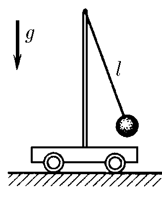

###  Statement 

$3.1.15.$ The amplitude of small oscillations of a mathematical pendulum standing on a cart is $x_0$, and the amplitude of oscillations of the cart is $y_0$. The length of the pendulum thread is $l$. Determine the maximum speed of the pendulum and cart. Neglect friction. 

### Solution

Law of conservation of energy $$ \frac{mg(x_0+y_0)^2}{2l}=\frac{m\upsilon^2}{2}+\frac{MU^2}{2} $$ Law of conservation of momentum $$ m\upsilon =MU $$ Because the center of mass does not change position $$ mx_0=My_0 $$ Let's solve the upper equation for $\upsilon$: $$ \upsilon =\sqrt{\frac{Mg}{(M+m)l}(x_0+y_0)^2}=\sqrt{\frac{x_0g}{(x_0+y_0)l}(x_0+y_0)^2} $$ Maximum speed of the pendulum $$ \boxed{v=x_0\sqrt{\frac{g}{l}(1+\frac{y_0}{x_0})}} $$ Let's solve the upper equation for $U$: $$ U=\sqrt{\frac{mg}{(M+m)l}(x_0+y_0)^2}=\sqrt{\frac{y_0g}{(x_0+y_0)l}(x_0+y_0)^2} $$ Maximum speed of the trolley $$ \boxed{U=y_0\sqrt{\frac{g}{l}(1+\frac{x_0}{y_0})}} $$ 

#### Answer

$$\upsilon =x_0\sqrt{\frac{g}{l}(1+\frac{y_0}{x_0}});\quad U=y_0\sqrt{\frac{g}{l}(1+\frac{x_0}{y_0})}$$ 
