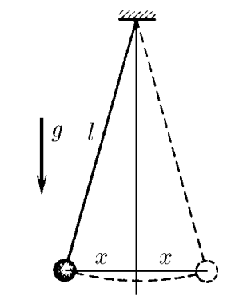

###  Statement 

$3.1.5.$ The length of the string of a mathematical pendulum is $l$, the mass of the ball is $m$. Determine the force acting on the ball as it deviates from the equilibrium position by $x$ in the case where $x \ll l$. How does the potential energy of the ball depend on $x$? 

### Solution

When the pendulum swings away, it is acted upon by a restoring force $F$ acting in the direction opposite to the direction of the velocity, which is restoring and equal to $$ OX:F=-mg\sin\varphi=\fbox{$-mg\frac{x}{l}$} $$ Considering that the oscillations are harmonic, their amplitude is not large, and the magnitude of the deviation is much less than the length of the thread: $(x\ll l)$. Let us use the expression for small angles $\cos\alpha\approx1-\frac{\alpha^2}{2};\quad\sin\alpha\approx\alpha$ $$ 1-\cos\alpha\approx\frac{x^2}{2l^2} $$ Changing the position of the ball vertically $$ \Delta h = l \cdot (1-\cos\alpha )=\frac{x^2}{2l} $$ Where does the change in potential energy come from? $$ \Delta U = mg\cdot\Delta h = \boxed{mg\frac{x^2}{2l}} $$ 

### Alternative solution

Alternatively, one could write the change in energy as an integral of the work done on the interval $dx$: $$ U=\int_{0}^{U}dU=\int_{0}^{x}mg\frac{x}{l}dx=\boxed{\frac{mgx^2}{2l}} $$ 

#### Answer

$$F=-mg\frac{x}{l};\quad U=\frac{mgx^2}{2l}$$ 
