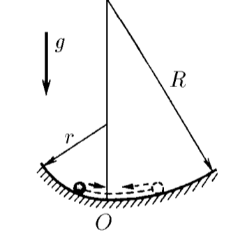
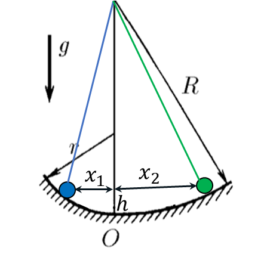

###  Statement 

$3.1.7.$ A horizontal trough to the left of the bottom line is bent on a cylindrical surface of radius $r$, and to the right, on a surface of radius $R$. Determine the ratio of the largest deflections to the left and to the right during small oscillations of the body in this trough. 

### Solution

According to the law of conservation of body energy, the maximum potential energy will be conserved in both cases $$ E_{p1}=E_{p2} $$ And therefore the height $h$ will rise relative to the lower point of the trajectory to which the body will rise will be equal 

  The position of the ball at the extreme points of the trajectory 

We will use the expression $\Delta U$ for small oscillations obtained in [3.1.5](../3.1.5) $$ \Delta U = \frac{mgx_1^2}{2r}=\frac{mgx_2^2}{2R} $$ Whence it follows that $$ \boxed{\frac{x_2}{x_1}=\sqrt{\frac{R}{r}}} $$ 

#### Answer

$$\frac{x_2}{x_1}=\sqrt{\frac{R}{r}}$$ 
