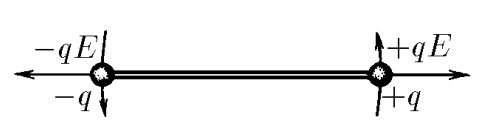

###  Statement 

$3.1.8.$ Two identical balls with charges $\pm q$, rigidly connected by a weightless rod of length $l$, are in an electric field, which acts on them with force $\pm q E$. Determine the mass of the ball if the amplitude of small transverse oscillations of the balls is $x_0$ and the maximum velocity of the balls is $v_0$. 

### Solution

Newton's second law for the normal force of the Coulomb, which creates a restoring moment of force, is found in projection onto the vertical axis $$ ma_\tau =-qE\sin\varphi $$ Since the angle $\varphi$ is negligibly small, we will use $\sin\varphi\approx\varphi$ $$ -qE\varphi=-qE\frac{2x}{l} $$ From where we obtain the equation of harmonic oscillations $$ m\ddot{x}(t)+\frac{2qE}{l}x(t)=0 $$ $$ \ddot{x}(t)+\frac{2qE}{ml}x(t)=0 $$ The solution to which we know: $$ \omega =\sqrt{\frac{2qE}{ml}} $$ From where, similarly to [3.1.6](../3.1.6), we find the maximum speed $$ \upsilon_0=x_0\omega =x_0\sqrt{\frac{2qE}{ml}} $$ After mathematical transformations we obtain the mass of the ball $$ \boxed{m=\frac{2qEx_0^2}{l\upsilon_0^2}} $$ 

#### Answer

$$m=\frac{2qEx_0^2}{l\upsilon_0^2}$$ 
