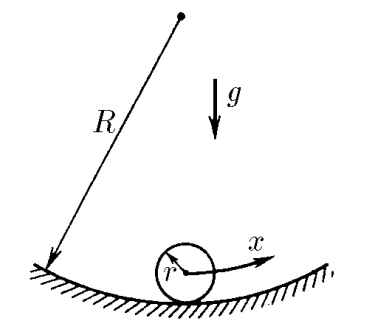

###  Statement

$3.1.9.$ A ball of mass $m$ and radius $r$ slides on the surface of a well whose radius of curvature is $R$. Find the dependence of the potential energy of the ball on a small displacement $x$ from the equilibrium position.

### Solution

As in [3.1.5](../3.1.5), we will propose two possible solutions: through small transformations and through integration

When the body deviates horizontally by a small value $x$, its height changes by the value

$$
h=R'-\sqrt{{R'}^2-x^2}=R'\left(1-\sqrt{1-\frac{x^2}{{R'}^2}}\right)\tag{1}
$$

Where $R'$ is the distance from the center of curvature to the center of mass of the ball.

$$
R'=R-r
$$

Considering the smallness of $x$

$$
x\ll R'\Leftrightarrow \frac{x}{R'}\ll 1
$$

So we can use approximation $(1+\xi )^a\approx 1+\xi a$, where $\xi\ll 1$

$$
\left(1-\frac{x^2}{{R'}^2}\right)^{1/2}=1-\frac{x^2}{2{R'}^2}
$$

Substitute into $(1)$

$$
h=R'\cdot \frac{x^2}{2{R'}^2}=\frac{x^2}{2R'}
$$

Substitute into the formula for potential energy

$$
U=mgh=mg\frac{x^2}{2R'}
$$

Substituting the value for $R'$, we obtain the final expression

$$
\boxed{U=\frac{mgx^2}{2(R-r)}}
$$

### Alternative solution

The change in energy with a small change in coordinate can be found by definition

$$
dU=Fdx
$$

In this case, we will find the horizontal force that will return the ball to stable equilibrium taking into account the smallness of the angle $\varphi$

$$
F=mg\sin\varphi=mg\frac{x}{R-r}
$$

Where we find the potential energy through integration $dU$

$$
U=\int_{0}^{U}dU=\int_{0}^{x}mg\frac{x}{R-r}dx=\frac{mg}{R-r}\int_{0}^{x}xdx
$$

This integral is solved as

$$
\int_{0}^{x}xdx=\frac{mg}{R-r}\cdot\frac{x^2}{2}
$$

Where does the potential energy of the ball come from?

$$
\boxed{U=\frac{mgx^2}{2(R-r)}}
$$

#### Answer

$$
U=\frac{mgx^2}{2(R-r)}
$$