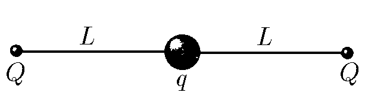

###  Statement

$3.2.11.$ Find the frequency of small oscillations of the system described in problem [3.1.10](../3.1.10)

### Solution

Newton's Second Law

$$
m\ddot{x}(t)-F=0
$$

Where we find the total external force from Coulomb's law

$$
F=kqQ\left(\frac{1}{(L-x)^2}-\frac{1}{(L+x)^2}\right)
$$

Using the approximation for a small value

$$
x =\frac{h}{R} \ll 1; \quad(1+x)^\alpha\approx 1+\alpha x
$$

$$
F=-\frac{4kqQLx}{(L^2-x^2)^2}\approx-\frac{4kqQx}{L^3}
$$

Harmonic oscillation equation

$$
\ddot{x}(t)+\frac{4kqQx}{mL^3}x(t)
$$

We obtain the required frequency of small oscillations

$$
\boxed{\omega =\sqrt{\frac{4kqQ}{mL^3}}=\sqrt{\frac{qQ}{m\pi\varepsilon_0L^3}}}
$$

#### Answer

$$
\omega =\sqrt{\frac{qQ}{m\pi\varepsilon_0L^3}}
$$