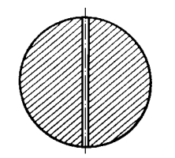
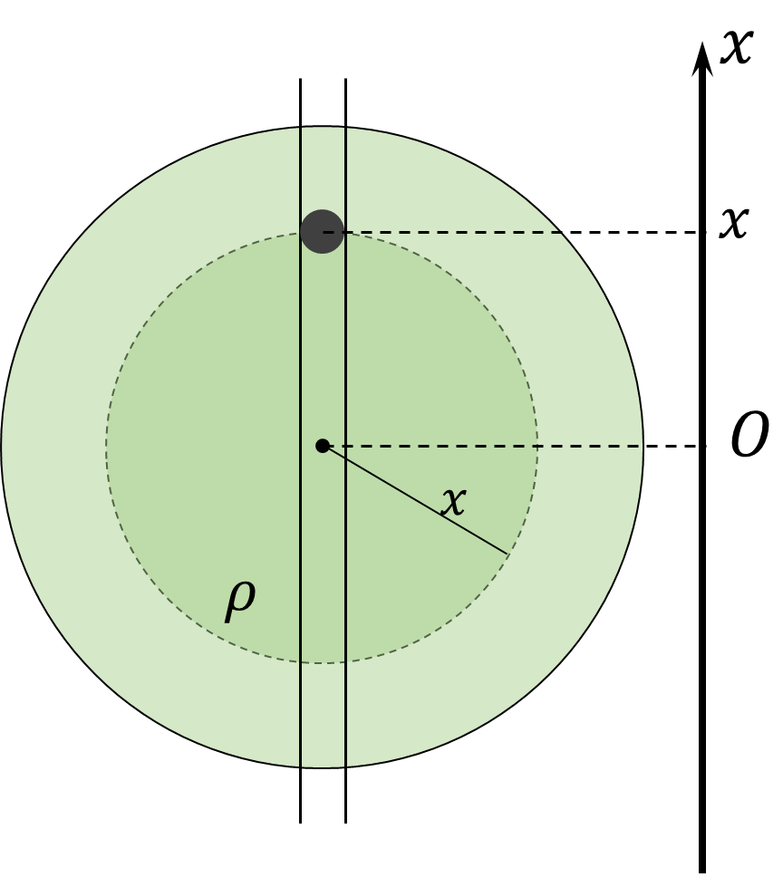

###  Statement 

$3.2.12.$ Determine the flight time of a stone from one pole of the Earth to the other along a straight tunnel dug through the center. Consider Earth's density constant, its radius equal to $6400$ km. 

### Solution

  Body at distance $x$ from the planet's core 

The body, at a distance $x$ from the core, will be subject to the gravitational force of attraction caused by the inner layers of the planet of density $\rho$, forming a sphere of radius $x$. The mass of this part of the earth $$ M_\oplus = \frac{4}{3} \rho\pi x^3 $$ Gravitational force acting on a rock at depth $x$ $$ F_G = \frac{GmM_\oplus}{x^2}=mg\frac{x}{R} $$ Newton's Second Law $$ m\ddot{x}(t)=-\frac{mg}{R}x(t) $$ Let's write the equation of harmonic oscillations $$ \ddot{x}(t)+\frac{g}{R}x(t)=0 $$ The angular frequency of such oscillations $$ \omega =\sqrt{\frac{g}{R}}\Rightarrow T=2\pi\sqrt{\frac{R}{g}} $$ Since we are interested in the flight time only in one direction, we take half of this period. $$ \boxed{t=\frac{T}{2}=\pi\sqrt{\frac{R}{g}}=42\text{ min}} $$ 

#### Answer

$$t=42\text{ min}$$ 
