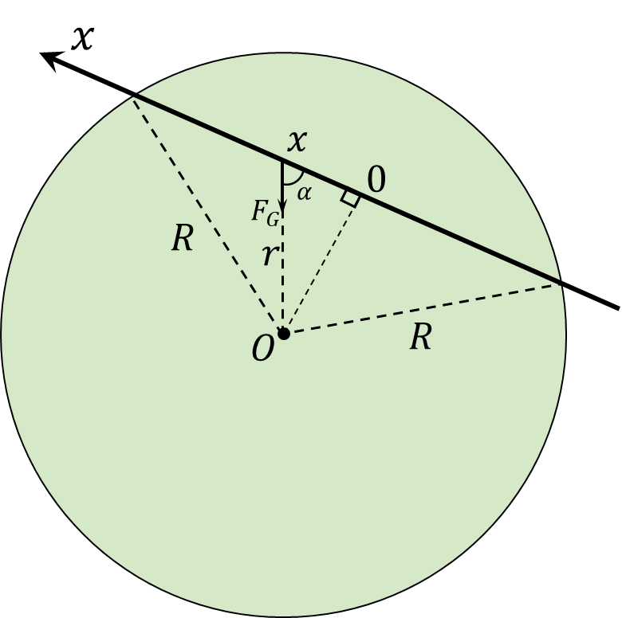

###  Statement

$3.2.13.$ A straight tunnel is dug in the Earth that does not pass through its center. Determine the time of movement of a train with engines turned off through such a tunnel if the influence of the Earth's rotation on the movement of the train and friction are neglected.

### Solution

Similarly to [3.2.12](../3.2.12), we find the external force $F$ as

The body, at a distance $x$ from the core, will be affected by the gravitational force of attraction caused by the inner layers of the planet with density $\rho$, forming a sphere of radius $x$. The mass of this part of the earth

$$
M_\oplus = \frac{4}{3} \rho\pi x^3
$$

Gravitational force acting on a rock at depth $x$

$$
F_G = \frac{GmM_\oplus}{x^2}=mg\frac{x}{R}
$$

In this case, only the horizontal component of this force will create a moment. Whence, the resulting external force is equal to

$$
F=mg\cos\alpha =mg\frac{x}{R}
$$

From here we find the angular frequency of oscillations

$$
\omega =\sqrt{\frac{g}{R}}
$$

The period of oscillation in a given system

$$
T=2\pi\sqrt{\frac{R}{g}}
$$

Since we are interested in the flight time only in one direction, we take half of this period.

$$
\boxed{t=\frac{T}{2}=\pi\sqrt{\frac{R}{g}}\approx42\text{ min}}
$$

#### Answer

$$
t=42\text{ min}
$$