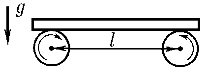
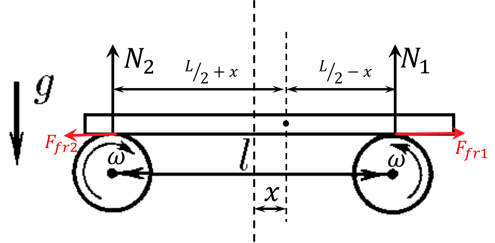

###  Statement

$3.2.14.$ A board of mass $m$ lies on two rollers rotating with high speed towards each other. The distance between the axes of the rollers is $L$, the coefficient of friction when the board slides on the roller is $\mu$. Find the frequency of longitudinal oscillations of the board.

### Solution

  Forces acting on the board

Newton's second law for the horizontal axis

$$
ma=F_{fr1}-F_{fr2}
$$

Equilibrium condition for the vertical axis

$$
mg=N_1+N_2\quad(1)
$$

In the equilibrium condition, the sum of the moment of external forces must be equal to zero.

$$
N_1\left(\frac{l}{2}-x\right)-N_2\left(\frac{l}{2}+x\right)=0
$$

Where does the reaction force on the second support come from?

$$
N_2=N_1\left(\frac{L/2-x}{L/2+x}\right)
$$

Substitute into $(1)$

$$
mg=N_1\left(1+\frac{L/2-x}{L/2+x}\right)
$$

$$
N_1=mg\left(\frac{L/2+x}{L}\right);\quad N_2=mg\left(\frac{L/2-x}{L}\right)
$$

Newton's second law for the horizontal axis

$$
m\ddot{x}=\mu N_2-\mu N_1= - \mu mg \frac{2x}{L}\quad(2)
$$

We transform the obtained expression and obtain the equation of harmonic oscillations

$$
\ddot{x}(t)+\frac{2\mu g}{l}x(t)=0
$$

Where does the angular frequency of oscillations come from?

$$
\boxed{\omega =\sqrt{\frac{2\mu g}{l}}}
$$

#### Answer

$$
\omega =\sqrt{\frac{2\mu g}{l}}
$$