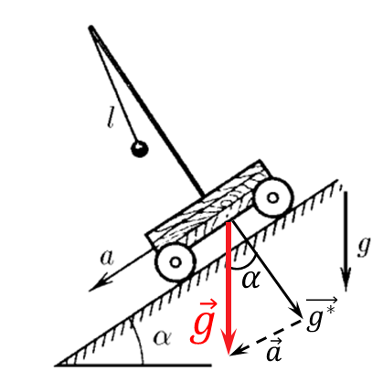

###  Statement

$3.2.16.$ A heavy cart rolls with acceleration $a$ on an inclined plane forming an angle $\alpha$ with the horizon. Find the period of oscillation of a pendulum of length $l$ mounted on the cart.

### Solution

  Acceleration vector $\vec{g}^*$ in an inertial frame of reference

The period of oscillation of a pendulum on an inclined cart can be found using the well-known formula for the period of oscillation of a mathematical pendulum, by switching to the inertial frame of reference of the cart

$$
T=2\pi\sqrt{\frac{l}{g^*}}\quad(1)
$$

Where $\vec{g}^*$ is the acceleration of the inertial reference frame

$$
\vec{g}^*=\vec{g}-\vec{a}
$$

Using the cosine law, we find the value of the modulus of the vector $\vec{g}^*$

$$
(g^{*})^2=a^2+g^2-2ag\cos\alpha
$$

Where

$$
\boxed{g^*=\sqrt{a^2+g^2-2ag\cos\alpha}}
$$

We substitute $(1)$ into the expression and find the period of oscillation of the pendulum

$$
\boxed{T=2\pi\sqrt{\frac{l}{\sqrt{a^2+g^2-2ag\cos\alpha}}}}
$$

#### Answer

$$
T=2\pi\sqrt{l/{\sqrt{a^2+g^2-2ag\cos\alpha}}}
$$