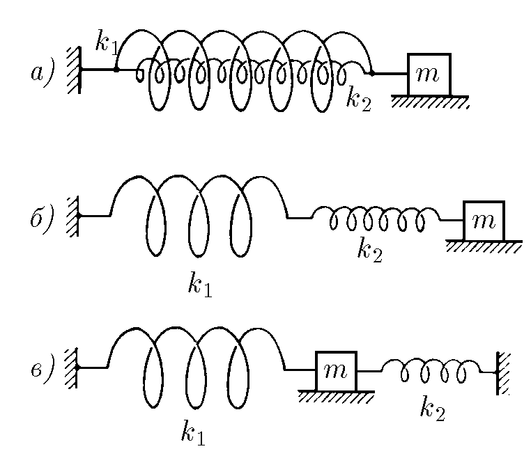
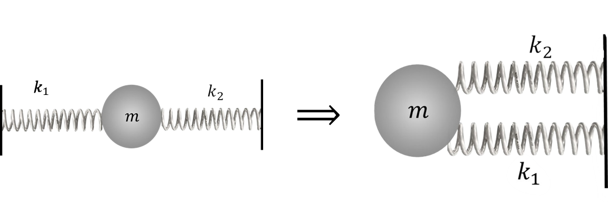

###  Statement 

$3.2.4.$ Find the period of oscillation of the oscillator systems shown in the figures. Does the period of oscillation of the oscillator in the third figure depend on the distance between the walls? $k_1$ and $k_2$ are the stiffness of the springs, $m$ is the mass of the body. 

### Solution

The period of oscillation of a spring pendulum is found as $$ T=2\pi\sqrt{\frac{m}{k}}\tag{1} $$ Next, we will find and use the equivalent stiffness for each spring system under study 

a) Based on the results from [2.1.15](../../2/2.1.15), we found that when springs are connected in parallel, their equivalent stiffness $$ k'=k_1+k_2 $$ Substituting into $(1)$: $$ T_1=2\pi\sqrt{\frac{m}{k_1+k_2}} $$ b) Alternatively, from [2.1.16](../2.1.16), we obtained that when springs are connected in parallel, their equivalent stiffness is $$ k'=\frac{k_1\cdot k_2}{k_1+k_2} $$ Substituting into $(1)$: $$ T_2=2\pi\sqrt{\frac{m(k_1+k_2)}{k_1\cdot k_2}} $$ c) Also in [2.1.16](../2.1.16), we showed that this scheme is equivalent to the case of parallel connection of springs 

  

Equivalent spring stiffness $$ k'=k_1+k_2 $$ Substituting into $(1)$: $$ T_3=2\pi\sqrt{\frac{m}{k_1+k_2}} $$ 

#### Answer

$$T_1=2\pi\sqrt{\frac{m}{k_1+k_2}}$$ $$T_2=2\pi\sqrt{\frac{m(k_1+k_2)}{k_1k_2}}$$ $$T_3=2\pi\sqrt{\frac{m}{k_1+k_2}}$$ 
