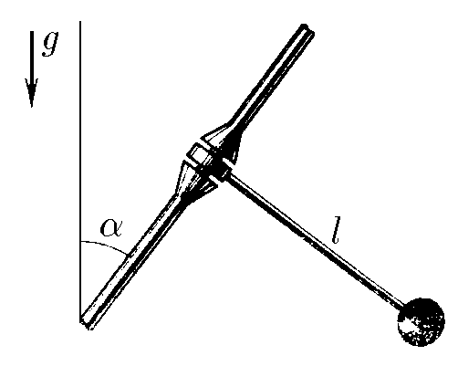

###  Statement

$3.2.6.$ A pendulum is a light and rigid rod of length $l$ with a weight at its end. To make the period of oscillations of the pendulum large without excessive increase in the size of the pendulum itself, its axis is set at an angle $\alpha$ to the vertical. Determine the period of oscillation.

### Solution

We will split $\vec{g}$ into two components $\vec{g_x}$ and $\vec{g_y}$

In this case, only $\vec{g_x}$ creates a moment of force, since $\vec{g_y}$ tries to break it out of the mount

$$
g_x=g\cos\alpha
$$

We substitute the acceleration into the formula for the period of oscillation of a mathematical pendulum

$$
\boxed{T=2\pi\sqrt{\frac{l}{g_x}}=2\pi\sqrt{\frac{l}{g\cos\alpha}}}
$$

#### Answer

$$
T=2\pi\sqrt{\frac{l}{g\cos\alpha}}
$$