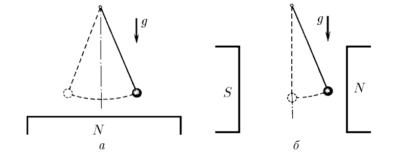

###  Statement

$3.2.7.$ a. A mathematical pendulum - an iron ball of mass $m$ hanging on a long string - has a period $T_0$. In the presence of a magnet placed slightly below the ball, the period of oscillation became equal to $T$. Determine the magnetic force acting on the ball.

b. An iron pendulum ball is placed between the poles of a magnet so that a horizontal magnetic force acts on it. Find this force and the new equilibrium position of the ball if the period of its oscillations after the magnetic field is switched on becomes equal to $T$.

### Solution

a) The period of oscillation of a mathematical pendulum

$$
T_{0}=2\pi\sqrt{\frac{l}{g}}; \quad T = \frac{2\pi}{\omega}\quad(1)
$$

Harmonic oscillation equation

$$
m\ddot{x}=- (mg + F)\sin\varphi = - (mg + F)\frac{x}{l}
$$

Where does the angular frequency of oscillations come from?

$$
\omega = \sqrt{\frac{mg+F}{ml}}
$$

From $(1)$

$$
\frac{T^{2}}{T_{0}^{2}}=\frac{mg}{mg + F} \Rightarrow \fbox{$F =\frac{mg(T_{0}^{2}-T^{2})}{T^{2}}$}
$$

b) For the second case, we write the equation of harmonic oscillations

$$
m\ddot{x}=- \left(\sqrt{(mg)^{2} + F^{2}}\right)\sin\varphi
$$

Given the approximation value $\sin\varphi =\frac{x}{l}$

$$
m\ddot{x} = - \left(\sqrt{(mg)^{2} + F^{2}}\right)\cdot\frac{x}{l}
$$

Solving the equation of harmonic oscillations of the form $\ddot{x}+\omega^2x=0$, we obtain the angular frequency

$$
\omega =\sqrt{\frac{\sqrt{(mg)^{2}+F^{2}}}{ml}}
$$

Similarly, substituting into $(1)$

$$
\frac{T_{0}^{4}}{T^{4}} = \frac{(mg)^{2}+ F^{2}}{(mg)^{2}} \Rightarrow \fbox{$F = mg\sqrt{\frac{T_{0}^{4}-T^{4}}{T^{4}}}$}
$$

#### Answer

$$
F =\frac{mg(T_{0}^{2}-T^{2})}{T^{2}};\quad F = mg\sqrt{\frac{T_{0}^{4}-T^{4}}{T^{4}}}
$$