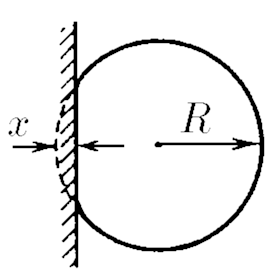

###  Statement

$3.3.8^*.$ The balloon deforms when it weakly hits the wall, as shown in the figure. The maximum deformation of the balloon $x$ is much smaller than its radius $R$. Ignoring the change in excess pressure $\Delta p$ of air in the balloon and the elasticity of the shell, estimate the time of impact with the wall. The mass of the ball $m$.

### Solution

$$
y=R-x
$$

$$
r^2=R^2-(R-x)^2
$$

$$
S=\pi r^2=\pi (R^2-(R-x)^2)
$$

Considering $x \ll R$

$$
S=\pi r^2=\pi (R^2-(R-x)^2)=2\pi Rx
$$

Newton's second law in differential form:

$$
-F=m\ddot{x}
$$

$$
m\ddot{x}+F=0 \Rightarrow m\ddot{x}+2\pi Rx \cdot \Delta p=0
$$

$$
\ddot{x}+\frac{2\pi R\Delta p}{m}x=0
$$

Recalling the differential equation of harmonic motion

$$
\ddot{x}+\omega^2x=0
$$

Find the cyclic frequency $\omega$ of oscillation

$$
\omega =\sqrt{\frac{2\pi R\Delta p}{m}}
$$

Since we're interested in half of the full period, estimated time of impact with the wall could be found as

$$
t=\frac{1}{2}\frac{2\pi}{\omega}=\frac{\pi}{\omega}
$$

$$
\boxed{t=\pi\sqrt{\frac{m}{2\pi R\Delta p}}}
$$

#### Answer

$$
t=\pi\sqrt{m/(2\pi R\Delta p)}
$$