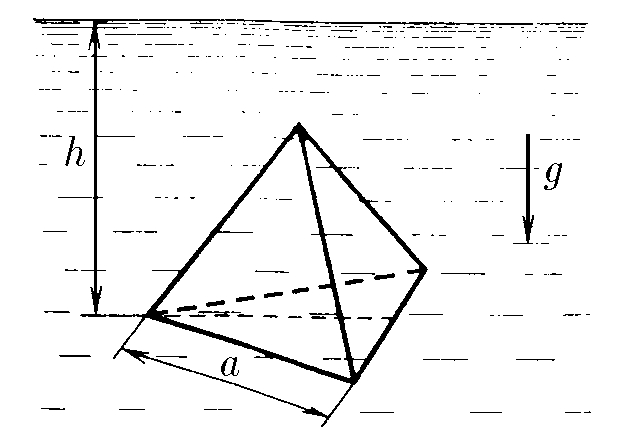
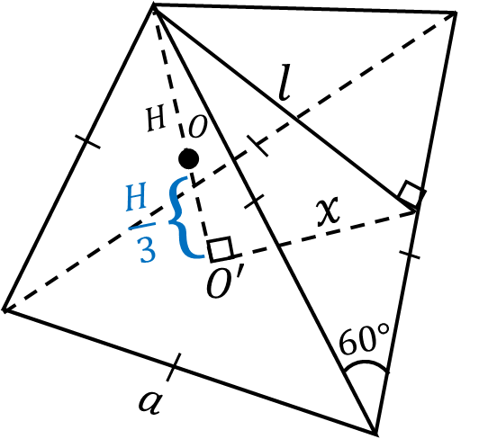

###  Statement 

$4.1.12^*.$ The bottom face of a regular tetrahedron with edge $a$, completely immersed in a liquid of density $\rho$, is at depth $h$. Determine the force exerted by the liquid on the side edge of the tetrahedron if the atmospheric pressure is $P$. 

### Solution

  Geometry of the problem 

From the drawing, we could obtain the following expressions $$l=a\sin(60^{\circ}) = \frac{\sqrt{3}}{2}a$$ Height of the center of mass above the base of the tetrahedron $$h_0=\frac{H}{3}$$ 

  A close look at the base of the pyramid 

After a close look at the basement of the tetrahedron, we could obtain the base area $$S=\frac{\sqrt{3}}{4}a^2$$ On the other hand, Pythagoras' theorem $$H^2=l^2-x^2=\frac{2}{3}a^2$$ Whence the height of the tetrahedron is equal to $$H=\sqrt{\frac{2}{3}}a$$ Since the center of mass of the pyramid is located at the point $O'$, it is known that the pyramid its height above the base is $$OO' = h_0 = \frac{1}{3}\sqrt{\frac{2}{3}}a$$ In this case, the pressure difference between the surface of the water and the level of the center of mass is $$p_0=\rho g (h-h_0)=\rho g \left(h-\frac{1}{3}\sqrt{\frac{2}{3}}a\right)$$ Hence, the force acting on the side of the pyramid (force due to water pressure): $$F_0 = p_0S = \rho ga^2\left(\frac{\sqrt{3}}{4}h - \frac{\sqrt{2}}{12}a \right)$$ After mathematical transformations $$F_0 = \frac{\rho g a^2}{12}\left(3\sqrt{3}h - \sqrt{2}a \right)$$ Force acting on the side of the pyramid (force due to water pressure and atmospheric pressure) $$F=pS+F_0 = \frac{\sqrt{3}}{4}a^2p+F_0$$ $$\boxed{F = \frac{\rho g a^2}{12}\left(3\sqrt{3}h - \sqrt{2}a \right) + \frac{\sqrt{3}}{4} pa^2}$$ 

#### Answer

$$F =\frac{1}{12}\rho ga^2(3\sqrt{3} h-\sqrt{2} a)+\frac{1}{4}Pa^2\sqrt{3}$$ 
