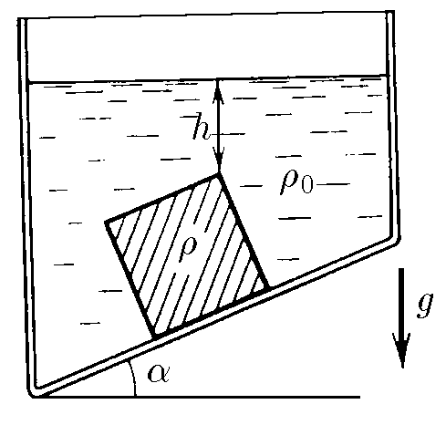
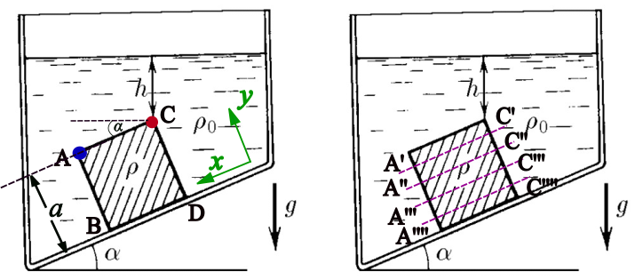
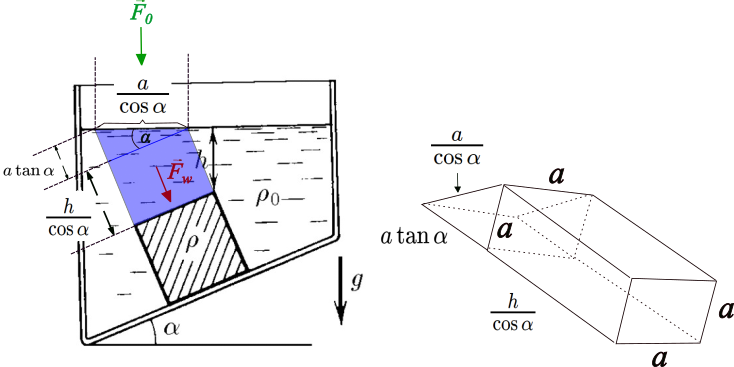

###  Statement 

$4.1.13^*$ A cube of side $a$, made of a material of density $\rho$, is found on container's bottom that forms an angle $\alpha$ with the horizon. Find the force which the cube acts over bottom, if a liquid of density $\rho_0$ fills the container. The superior side of cube is at distance $h$ from the liquid's surface. Between the container's bottom and the cube there is no liquid. The atmospheric pressure is $P$ and the acceleration due to gravity is $g$. 

### Solution

Let's define the $y$-axis perpendicular to bottom and the $x$-axis parallel to it. At $y$-axis there is no buoyancy force because between bottom and the cube there is no liquid. 

The pressures at points $A$ and $C$ are $$P_A = P + \rho_0 g(h+a\sin{\alpha})$$ $$P_C = P + \rho_0 gh$$ If both equations are rested, $$P_A-P_C = \rho ga\sin{\alpha} \tag{1}$$ Note that difference of pressures between any point over side $AB$ and any point over $CD$ is expressed by $(1)$ (for any two points at same $y$ and at $a$ distance one from the other). If $(1)$ is multiplied by the side area $a^2$, buoyancy force can be found for $x$-axis $$F_x = \rho g a^3 \sin{\alpha} \tag{2}$$ Applying Newton's Second Law for $x$-axis, also considering friction force $$mg\sin{\alpha} = f_r + F_x$$ As $m = \rho a^3$ and according $(2)$ $$\boxed{f_r = a^3 g (\rho -\rho_0)\sin{\alpha}}$$ This force is "felt" by bottom in opposed direction of $x$-axis. Now, pressure force $F_p$ which acts in $y$-axis, generated by above water mass and the atmospher, must be found. 

Atmospheric-pressure force is $$F_0 = \frac{Pa^2}{\cos{\alpha}}$$ but the cube doesn't "feel" that force, else a component of it ($F_{0y}$). $$F_{0y} = F_0\cos{\alpha} = Pa^2 \tag{3}$$ The pressure exerted by water mass is $$F_w = m_w g \cos{\alpha} = \rho_0 V_w g \cos{\alpha} \tag{4}$$ This volume of water $V_w$ is $$V_w = \frac{a^2h}{\cos{\alpha}} + \frac{a^3\tan{\alpha}}{2} \tag{5}$$ Putting $(5)$ into $(4)$ $$F_w = \rho_0 g a^3\left(\frac{h}{a}+\frac{\sin{\alpha}}{2}\right) \tag{6}$$ The pressure force over superior side of cube is $$F_p = F_{0y} + F_w \tag{7}$$ Substituting $(3)$ and $(6)$ into $(7)$ $$F_p = Pa^2 + \rho_0 g a^3\left(\frac{h}{a}+\frac{\sin{\alpha}}{2}\right) \tag{8}$$ Applying Newton Second Law for $y$-axis $$N = mg\cos{\alpha}+F_p = \rho a^3g\cos{\alpha}+F_p \tag{9}$$ and according to $(8)$ $$\boxed{N = a^3\rho_0 g \left(\frac{\rho}{\rho_0}\cos{\alpha}+\frac{1}{2}\sin{\alpha}+\frac{h}{a}\right)+Pa^2}$$ This normal force is directed in opposed direction of $y$-axis. Friction force $f_r$ is the parallel reaction force $F_{||}$ and normal force is the perpendicular one $F_{\perp}$. 
