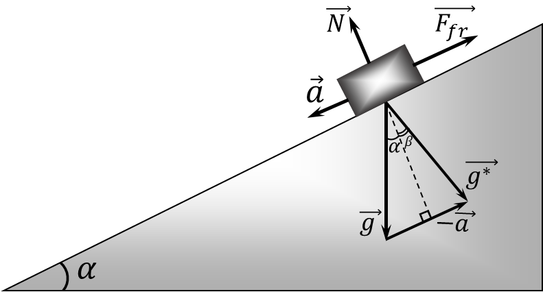

###  Statement 

$4.1.22.$ At what angle to the horizon will the surface of the liquid in the vessel slide on an inclined plane that makes an angle $\alpha$ to the horizon if the friction coefficient is $\mu$? 

### Solution

The vessel with liquid goes downward with acceleration $a$ as shown in the figure

Given the reaction force $N=mg\cos\alpha$, the sliding friction force is found as $$F_\text{fr} = \mu N = \mu mg\cos\alpha$$ Newton's second law for the vessel $$ma = mg\sin\alpha -F_\text{fr}$$ $$\boxed{a=g(\sin\alpha -\mu\cos\alpha )}\tag{1}$$ Let us introduce the effective acceleration of free fall $\vec{g^*}$ in a non-inertial frame of reference associated with the vessel, then vectorially, it is found as $$\vec{g^*}=\vec{g}-\vec{a}$$ 

 

From the drawing it could be found that $$\tan\beta = \frac{a - g\sin\alpha}{g\cos\alpha} = -\mu$$ The angle between the water level and the horizon will be $$\boxed{\gamma = \alpha -\operatorname{\arctan }\mu}$$ 

#### Answer

$$\gamma =\alpha -\operatorname{\arctan }\mu$$ 
