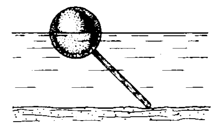
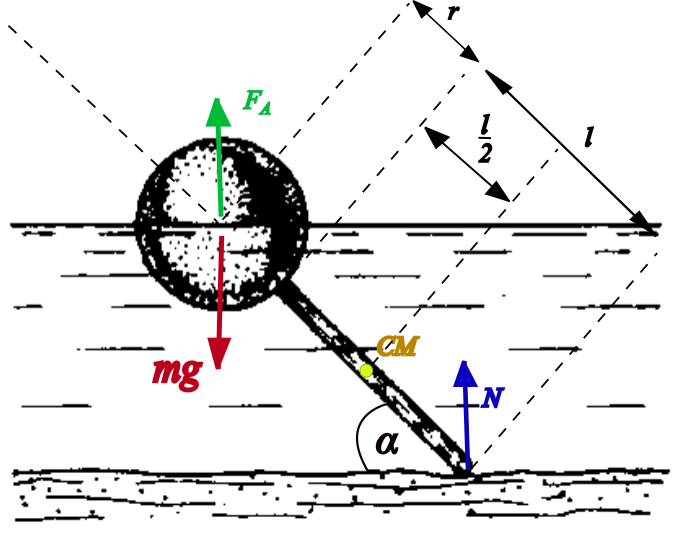

###  Statement

$4.2.11$ With what force a heavy stick presses on the bottom of the reservoir, if a hollow ball of radius $r$, rigidly connected to the stick, is half immersed in the liquid? The density of the liquid is $\rho$, the length of the stick is $l$.

### Solution

Let's consider the following figure

The system is on equilibrium in above position, so total torque is zero ($\sum \vec{\tau} = \vec{0}$). Considering as a pivot point the center of mass of the stick (located at stick's half),

$$
F_A\left(\frac{l}{2}+r\right)\sin{\left(\frac{\pi}{2}-\alpha\right)}+mg\left(\frac{l}{2}+r\right)\sin{\left(\frac{\pi}{2}+\alpha\right)}+N\frac{l}{2}\sin{\left(\frac{\pi}{2}+\alpha\right)}=0
$$

$$
F_A\left(\frac{l}{2}+r\right)\cos{\alpha}-mg\left(\frac{l}{2}+r\right)\cos{\alpha}-N\frac{l}{2}\cos{\alpha}=0
$$

$$
F_A\left(\frac{l}{2}+r\right)-mg\left(\frac{l}{2}+r\right)-N\frac{l}{2}=0
$$

$$
\rho~g~\frac{V}{2}\left(\frac{l}{2}+r\right)-mg\left(\frac{l}{2}+r\right)-N\frac{l}{2}=0
$$

Separating $N$, and considering that ball's mass can be expressed as $m=\rho_0 V$ and ball's volume is $V=\frac{4}{3}\pi r^3$

$$
N = \frac{2\pi r^3g}{3}\left(1+2\frac{r}{l}\right)(\rho -2\rho_0)
$$

But, since the ball is a hollow sphere, it can be considered massless, so $\rho_0 = 0$, then

$$
\boxed{N = \frac{2\pi r^3\rho g}{3}\left(1+2\frac{r}{l}\right)}
$$

Another way: Let's suppose the pivot point at the contact of stick with the bottom. Applying Newton Second Law for rotation ($\sum \vec{\tau} = \vec{0}$) and considering the massless ball

$$
F_A\left(l+r\right)\sin{\left(\frac{\pi}{2}-\alpha\right)}+m_s~g\frac{l}{2}\sin{\left(\frac{\pi}{2}+\alpha\right)}=0
$$

$$
F_A\left(l+r\right)\cos{\alpha}-m_s~g\frac{l}{2}\cos{\alpha}=0
$$

Hence, the mass of the stick is

$$
m_s = \rho~V\left(1+\frac{r}{l}\right) \tag{1}
$$

Applying Newton Second Law

$$
F_A+N = m_s~g
$$

$$
\rho g \frac{V}{2} + N = m_s g \tag{2}
$$

From $(1)$, $(2)$ and taking $V=\frac{4\pi r^3}{3}$, the above answer is obtained again...