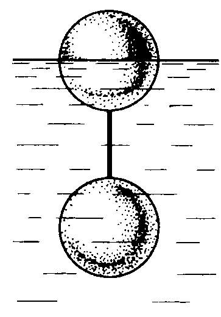
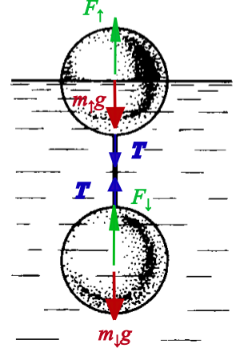

###  Statement

$4.2.12$ Determine the force of the tension of the thread connecting two balls of volume 10 cm$^3$ each, if the upper ball floats half-immersed in water. The lower ball is three times heavier than the upper one.

### Solution

Applying Newton's Second Law...

For upper ball

$$
m_{\uparrow}~g+T = F_{\uparrow}
$$

$$
m_{\uparrow}~g+T = \rho_0~g~\frac{V}{2} \tag{1}
$$

For lower ball

$$
m_{\downarrow}~g = T+F_{\downarrow}
$$

$$
m_{\downarrow}~g = T+\rho_0~g~V \tag{2}
$$

Separating the gravity's force term from $(1)$

$$
m_{\uparrow}~g = \rho_0~g~\frac{V}{2}-T \tag{3}
$$

Dividing $(2)$ by $(3)$, and taking account that $m_{\downarrow}=3~m_{\uparrow}$

$$
\frac{\rho_0~g~V+T}{\rho_0~g~\frac{V}{2}-T}=3
$$

and separating $T$

$$
T = \frac{\rho_0~g~V}{8}
$$

Taking $\rho_0 = 1~\rm{g/cm^3} = 10^{-3}~\rm{kg/cm^3}$ (water's density) and $g=9.8~\rm{m/s^2}$ (acceleration due to gravity at Earth's surface),

$$
\boxed{T \simeq 1.2 \cdot 10^{-2}~\rm{N}}
$$