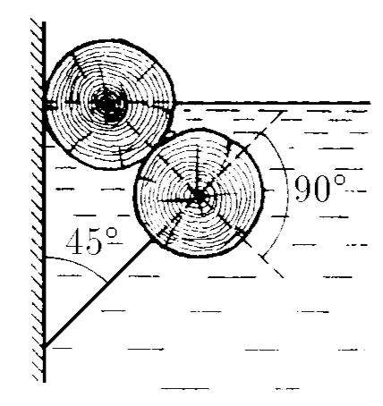
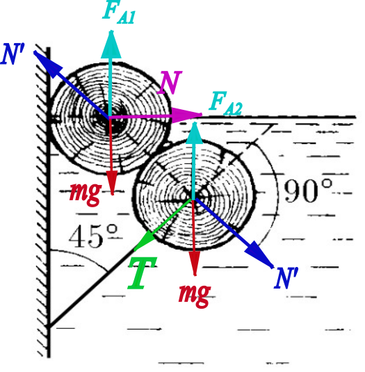

###  Statement

$4.2.13$ Two equal trunks are placed as the figure shows. The lower trunk is linked to the vertical wall by wires that form an angle of 45$^\circ$ with it. The upper trunk is half submerged in water. Find the density of the trunks.

### Solution

Let's analyze the following force diagram

  Force diagram for each trunk

Consider the trunks are perfect wooden cylinders. Applying Newton Second Law for cylinder 1, on $x$-direction,

$$
-N'\cos{45^\circ}+N = 0 \quad(1)
$$

and on $y$-axis

$$
mg = \rho_0 g V_s + N'\sin{45^\circ} = \rho_0 g V_{s1} + N'\frac{\sqrt{2}}{2}
$$

as trunk 1 is half submerged, $V_{s1} = \frac{\pi R^2 L}{2}$ and its mass is $m = \rho V$, so separating $\rho$

$$
\rho = \frac{1}{2}\left(\rho_0+\frac{N'\sqrt{2}}{\pi R^2 L}\right) \quad(2)
$$

Applying Newton Second Law for cylinder 2, on $x$-axis

$$
N'\cos{45^\circ}-T\cos{45^\circ}=0
$$

$$
N' = T \quad(3)
$$

and for $y$-axis

$$
\rho_0 g V_{s2} = T\sin{45^\circ}+N'\sin{45^\circ}+mg
$$

in this case $V_{s2} = \pi R^2 L$ and considering that $\sin{45^\circ}=\cos{45^\circ}=\frac{\sqrt{2}}{2}$,

$$
\rho_0 g \pi R^2 L = (T+N')\frac{\sqrt{2}}{2}+\rho g \pi R^2 L \quad(4)
$$

Putting $(3)$ int $(4)$

$$
(\rho_0-\rho )\pi R^2 L g = N' \sqrt{2} \quad(5)
$$

Substituting $(5)$ into $(2)$ and developing algebraically

$$
\rho = \frac{2}{3}\rho_0
$$

as the water's density is $\rho_0=1$ g/cm$^3$,

$$
\boxed{\rho =\frac{2}{3}~\rm{g/cm^3}}
$$