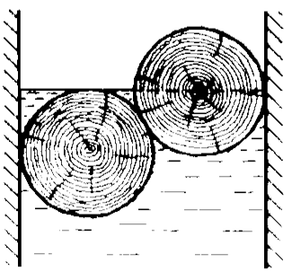
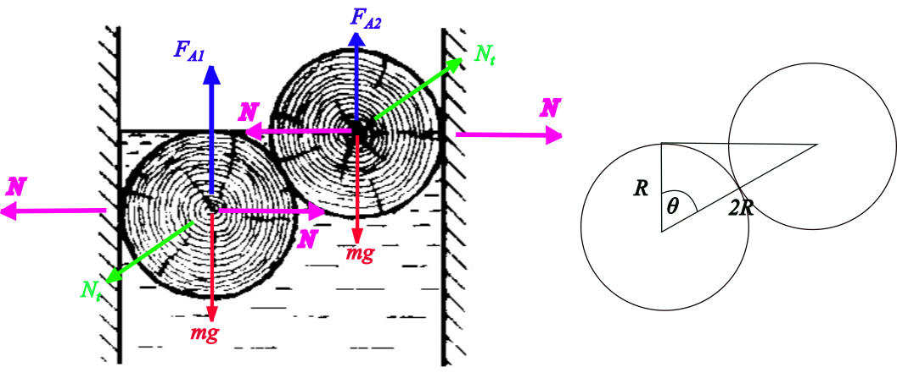

###  Statement

$4.2.14$ Determine the pressure force of the logs of mass $m$ on the walls of the channel. The upper log is half submerged in water, and the lower log touches the upper part of the water surface. The logs are equal.

### Solution

Let's consider the following figure

From right figure

$$
\cos{\theta} = \frac{R}{2R} = 0.5
$$

so, $\theta = 60^\circ$. Applying Newton Second Law for submerged trunk on $x$-axis,

$$
N = N_t~\sin{\theta} \tag{1}
$$

on $y$-axis

$$
F_{A1} = mg + N_t~\cos{\theta}
$$

$$
\rho_w~g~V = mg + N_t~\cos{\theta} \tag{2}
$$

For half-submerged trunk, on $x$-axis,

$$
N = N_t~\sin{\theta}
$$

on $y$-axis

$$
F_{A2} + N_t~\cos{\theta} = mg
$$

$$
\rho_w~g~\frac{V}{2} + N_t~\cos{\theta} = mg \tag{3}
$$

Substituting $(2)$ into $(3)$, it is obtained

$$
N_t = \frac{mg}{3~\cos{\theta}} \tag{4}
$$

Putting $(4)$ into $(1)$

$$
N = \frac{mg}{3}~\tan{\theta}
$$

$$
\boxed{N = \frac{mg}{\sqrt{3}}}
$$

Note: You can prove that both pressure forces generated by trunks are equals.