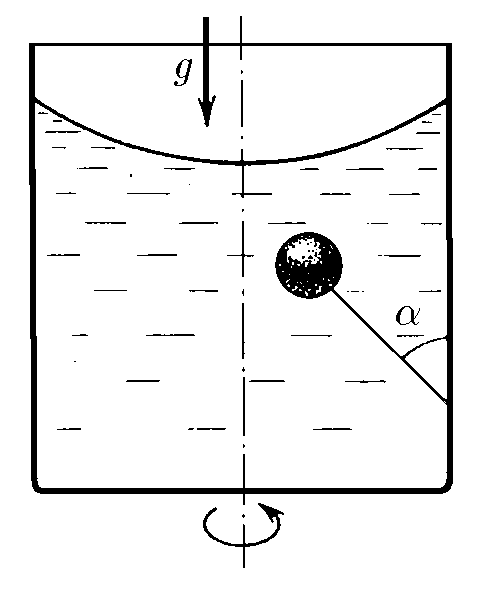
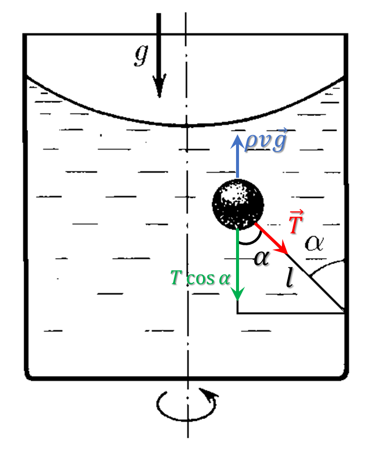

###  Statement 

$4.2.26.$ A vertical cylindrical vessel of radius $R$ partially filled with liquid rotates with the liquid around its axis. A balloon of radius $r$ is tied to the side wall of the vessel on a thread of length $l$; during rotation the thread forms an angle $\alpha$ with the wall. Determine the angular velocity of rotation of the vessel. 

### Solution

Since the ball does not float, the vertical Archimedean force is completely compensated by the vertical component of the thread tension force $$T\cos\alpha =\frac{4\pi r^3}{3}\rho g$$ From where we could find the thread tension force $$T=\frac{4\pi r^3}{3\cos\alpha}\rho g\tag{1}$$ Alternatively, we could write an equilibrium condition for the __Horizontal Archimedean force__ , which is compensated by the horizontal force of the thread tension $$T\sin\alpha = \rho V\omega^2x\tag{2}$$ It can be seen from the figure that the ball's center of mass is at a distance $l+r$ from the point of attachment of the thread: $$x=R-(l+r)\sin\alpha$$ After substituting into $(2)$ we obtain $$\rho\frac{4\pi r^3}{3}\omega^2\left(R-(l+r)\sin\alpha\right) = T\sin\alpha\tag{3}$$ Substituting $(1)$ into $(3)$ 

$$\rho\frac{4\pi r^3}{3}\omega^2\left(R-(l+r)\sin\alpha\right) = \frac{4\pi r^3}{3\cos\alpha}\rho g\sin\alpha$$

From where we find the angular velocity $$\boxed{\omega = \sqrt{\frac{g\tan\alpha}{R-(l+r)\sin\alpha}}}$$ 

#### Answer

$$\omega =\sqrt{(g\operatorname{tg}\alpha )/[R-(l+r)\operatorname{sin}\alpha ]}.$$ 
