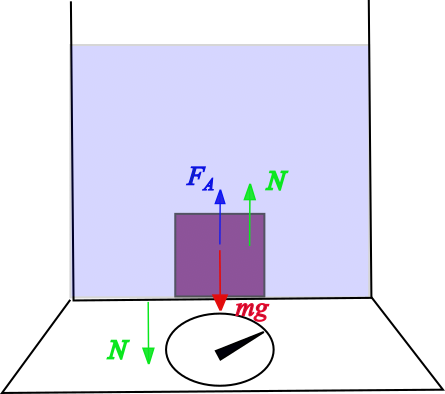

###  Statement

$4.2.6$ A piece of iron weighs $9.8 \mathrm{~N}$ in water. Determine its volume. The density of iron is $7.8 \cdot 10^3 \mathrm{~m^3}$.

### Solution

Let's consider the following figure

The normal force $N$ is what the equipment measures as apparent weight. From Newton Second Law

$$
N = mg-F_A
$$

$$
N = \rho~g~V-\rho_w~g~V
$$

$$
N = (\rho -\rho_w)~g~V
$$

and taking $\rho_w = 1000$ kg/m$^3$

$$
\boxed{V = \frac{N}{(\rho -\rho_w)~g}=147 \rm{cm}^3}
$$