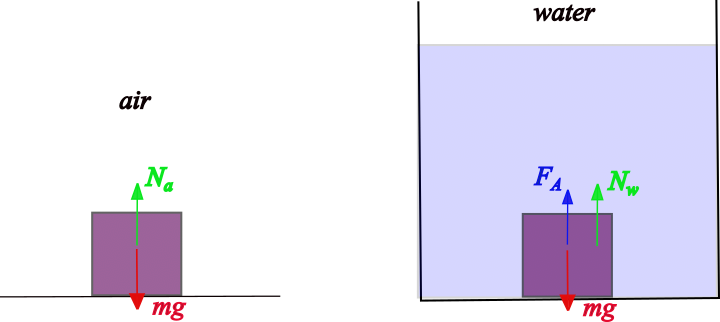

###  Statement

$4.2.7$ A body in water weighs three times less than in air. What is the density of the body?

### Solution

Let's consider the following figure

These normal forces $N_i$ is what the equipment measures as weight in each case. From Newton Second Law for air

$$
N_a = mg
$$

Since $m=\rho~V$,

$$
N_a = \rho~V~g \tag{1}
$$

Applying Newton Second Law for water

$$
mg = N_w + F_A
$$

$$
\rho~V~g = N_w + \rho_w~V~g
$$

$$
N_w = (\rho -\rho_w)~V~g \tag{2}
$$

Dividing $(1)$ by $(2)$, taking account that $\frac{N_a}{N_w} = 3$

$$
\rho = \frac{3}{2}\rho_w
$$

as $\rho_w = 1$ g/cm$^3$

$$
\boxed{\rho = 1.5~\rm{g/cm^3}}
$$