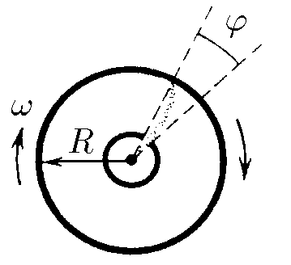

###  Statement

$5.2.9$ A molecular projector creates a ribbon-shaped narrow beam of silver's atoms that arrive to internal surface of a cylinder of radius $R = 30$ cm and form a spot. The device rotates with angular velocity $\omega = 100\pi$ s$^{-1}$. Find the beam's velocity, if the spot deviates an angle $\varphi=0.314$ rad respect to initial position.

### Solution

When first atom of the beam arrives to surface after a time $t$, the cylinder has sweep the angle $\varphi$. So

$$
\varphi=\omega t \tag{1}
$$

The atoms are displaced from center to surface during same time $t$, considering constant velocity $v$

$$
R=vt \tag{2}
$$

Dividing $(2)$ by $(1)$ and separating $v$

$$
\boxed{v = \frac{\omega R}{\varphi}=300 \;{\rm{m/s}}}
$$