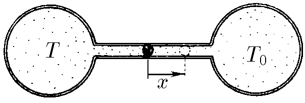

###  Statement

$5.5.16$ The gas thermometer consists in two identical containers with volume $V_0$ each one, linked by a tube of length $l$ and cross section $S$. A mercury droplet obstructs the tube. If temperatures of gasses in the volumes are equal, the mercury lies in the center of the tube. The right volume is connected to a thermostat with temperature $T_0$. Scale the thermometer finding the dependence between gas temperature in left volume and the displacement $x$ of mercury respect to equilibrium position.

### Solution

Let denote left volume as $V_1$ and right one as $V_2$. Applying state equation for each container

$$
P_1~V_1 = nRT \tag{1}
$$

$$
P_0~V_2 = nRT_0 \tag{2}
$$

It is easy to see that

$$
V_1 = V_0+S\frac{l}{2}-Sx \tag{3}
$$

$$
V_2 = V_0+S\frac{l}{2}+Sx \tag{4}
$$

If droplet is in equilibrium that means pressure forces due to gasses are equal, so $P_1 = P_0$. Then, dividing $(1)$ and $(2)$

$$
\frac{V_1}{V_2}=\frac{T}{T_0} \tag{5}
$$

Substituting $(3)$ and $(4)$ into $(5)$ and separating $T$

$$
\boxed{T = T_0~\frac{2V_0+S(l+2x)}{2V_0+S(l-2x)}}
$$

This is mathematically valid for $0< x <\frac{V_0}{S}+\frac{l}{2}$ but according the physical situation only for $0< x < \frac{l}{2}$.