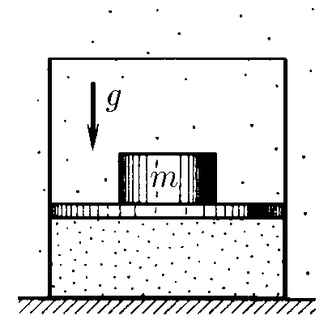

###  Statement

$5.5.3$ For diminishing isothermally $n$ times the volume of gas in a cylinder with piston, over this piston is putted a load of mass $m$. What load should be added such that the volume of gas decreases isothermally $k$ times more?

### Solution

Applying Newton's Second Law...

Initially, considering a massless piston

$$
P_0 = P_a \tag{1}
$$

When load of mass $m$ is putted over

$$
PS=mg+P_aS \tag{2}
$$

After the addition of the another load,

$$
P'S=(m+\Delta m)g+P_aS \tag{3}
$$

From Boyle-Mariotte Law

$$
P_0V_0 = P\frac{V_0}{n}
$$

$$
P_0 = \frac{P}{n} \tag{4}
$$

Substituting $(2)$ into $(3)$, according to $(1)$ and separating $P_a$

$$
P_a = \frac{mg}{S(n-1)} \tag{5}
$$

Applying Boyle-Mariotte Law again

$$
P\frac{V_0}{n}=P'\frac{V_0}{nk}
$$

$$
P=\frac{P'}{k} \tag{6}
$$

Substituting $(2)$ and $(3)$ into $(6)$ and developing algebraically

$$
\left(\frac{mg}{S}+P_a\right)(k-1)=\frac{\Delta mg}{S} \tag{7}
$$

Putting $(5)$ into $(7)$ and separating $\Delta m$

$$
\boxed{\Delta m=m\frac{(k-1)n}{(n-1)}}
$$

This problem can also be solved considering the mass of piston.