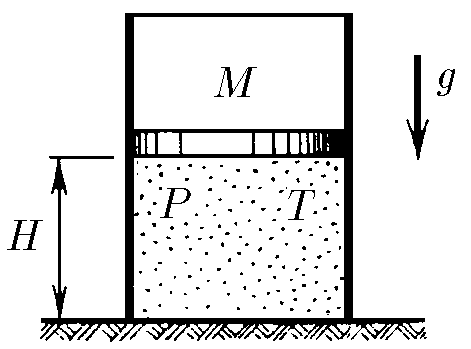

###  Statement

$5.6.22^*$ In a rarefied space, a cylindrical container remains vertically, covered at the top by a movable piston of mass $M$. Inside the closed volume, there is a monoatomic gas at temperature $T$ and pressure $P$. The interior cross-section of the cylinder is $S$, the height of volume where gas lies is $H$. The piston is set free and is moved. What maximum speed will develope the piston, if gas is compressed by the piston a) isothermally and b) adiabatically? The acceleration due to gravity is $g$.

### Solution

a) From Energy Conservation Law or Kinetic Energy - Work theorem

$$
\frac{Mv^2}{2} = Mg(H-y) + A \tag{1}
$$

where $A$ is the work done over the piston, equals to work done by gas, in this case (isothermal process) defined by

$$
A = nRT\ln{\frac{Sy}{SH}} = -nRT\ln{\frac{H}{y}} \tag{2}
$$

Substituting $(2)$ into $(1)$

$$
\frac{Mv^2}{2} = Mg(H-y) - nRT\ln{\frac{H}{y}} \tag{3}
$$

From Boyle-Mariotte Law

$$
PSH = P'Sy \tag{4}
$$

Applying state equation to initial state,

$$
n = \frac{PSH}{RT} \tag{5}
$$

$$
PSH = nRT
$$

Applying Newton's Second Law

$$
Mg - P(t)S = M\frac{dv}{dt}
$$

At the moment of maximum velocity, $dv/dt = 0$ and $P(t) = P'$, hence

$$
Mg = P'S \tag{6}
$$

Putting $(6)$ into $(4)$ and separating $y$

$$
y = \frac{PSH}{Mg} \tag{7}
$$

Substituting $(5)$ and $(7)$ into $(3)$ and separating $v$

$$
\boxed{v = \sqrt{2gH\left(1-\frac{PS}{Mg}+\frac{PS}{Mg}\ln{\frac{PS}{Mg}}\right)}}
$$

b) From Poisson's Law

$$
P(SH)^\gamma = P'(Sy)^\gamma\tag{8}
$$

The work done by the gas in an adiabatic process is given by

$$
A = \frac{PSH-P'Sy}{\gamma -1} \tag{9}
$$

According to $(6)$, we can modify $(8)$ and separating $y$, obtaining

$$
y = H\left(\frac{PS}{Mg}\right)^\frac{1}{\gamma} \tag{10}
$$

Putting $(9)$ into $(1)$, and taking account $(6)$,

$$
\frac{Mv^2}{2} = H\left(Mg+\frac{PS}{\gamma -1}\right)-Mgy\left(1+\frac{1}{\gamma -1}\right) \tag{11}
$$

Substituting $(10)$ into $(11)$, since gas is monoatomic ($i = 3$ and $\gamma = 5/3$), and separating $v$

$$
\boxed{v = \sqrt{2gH\left[1-\frac{5}{2}\left(\frac{PS}{Mg}\right)^\frac{3}{5}+\frac{3}{2}\frac{PS}{Mg}\right]}}
$$