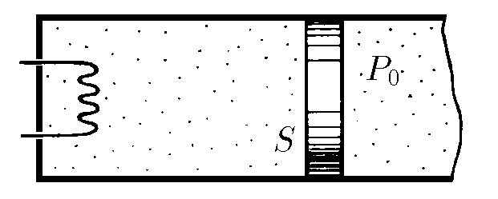

###  Statement

$5.6.26^*.$ A horizontally positioned cylinder containing $1$ mol of gas at an initial temperature $T_0$ and pressure $P_0$ is closed by a piston of section $S$. To the right of the piston is a constant atmospheric pressure $P_0$. The gas is heated by a spiral. When the piston moves, it is affected by the friction force $F$ from the cylinder walls. Half of the heat generated when the piston rubs against the cylinder walls goes to the gas. The internal energy of the gas is $U = cT$. How does the temperature of a gas depend on the amount of heat transferred to the gas by the spiral? Plot this relationship.

### Solution

The process will occur in two stages. At first, friction will prevent the piston from moving, and the gas will gradually heat up, and the pressure will increase isochronally. Then, as soon as we reach the threshold pressure, the piston will begin to move uniformly and the process will become isobaric. Let's consider the first process ($V = const$):

$$
d(pV) = d(\nu RT)
$$

Let us integrate the equation from $p_0$ to the threshold pressure $p$:

$$
\int_{p_0}^{p} V d\varphi = \int_{T_0}^{T} \nu R dT
$$

$$
(p - p_0)V = \nu R(T - T_0)
$$

Since the process is isochoric, then $V = V_0 = \frac{\nu RT_0}{p_0}$. And considering that the piston is stationary, $p = p_0 + \frac{F}{S}$. Substituting $V$ and $p$, we get:

$$
\frac{F}{S} \cdot \frac{T_0}{p_0} = T - T_0
$$

Let's write down the 1st law of thermodynamics, taking into account that $dA = 0$:

$$
dQ = dU = c \cdot dT \rightarrow Q = c(T - T_0)
$$

$$
T = T_0 + \frac{Q}{c} \quad \text{with} \quad Q \leq \frac{cT_0 F}{p_0 S}
$$

Let's consider the second process ($p = const$):

$$
d(pV) = d(\nu RT)
$$

$$
p dV = \nu R dT
$$

Now the piston has begun to move uniformly. According to the condition, half of the heat released by the piston friction against the cylinder walls goes into the gas. Let's find this heat:

$$
Q_F = F \cdot dx = F \cdot \frac{dV}{S} = \frac{F \nu R}{pS} dT
$$

Let's write down the 1st law of thermodynamics:

$$
dQ + \frac{dQ_F}{2} = dA + dU
$$

$$
\int_0^Q dQ = \int_{T_0}^{T} \left( \nu R + c - \frac{F \nu R}{2pS} \right) dT
$$

After integration, we get:

$$
Q = \left( \nu R + c - \frac{F \nu R}{2pS} \right) \cdot (T - T_0)
$$

From this expression, we find $T$:

$$
T = \frac{Q + cT_0 + RT_0 \left( 1 + \frac{F}{2p_0 S} \right)}{c \left( 1 + \frac{F}{p_0 S} \right) + R \left( 1 + \frac{F}{2p_0 S} \right)} \cdot (1 + \frac{F}{p_0 S}) \quad \text{with} \quad Q \geq \frac{cT_0 F}{p_0 S}
$$

#### Answer

$$
T=T_0+Q/c\text{ with }Q\leqslant Q_1=cT_0F/P_0S
$$

$$
T=\frac{Q+cT_0+RT_0(1+F/2P_0S)}{c(1+F/P_0S)+R(1+F/2P_0S)}\left(1+\frac F{P_0S}\right)\text{ with }Q\geqslant Q_1
$$