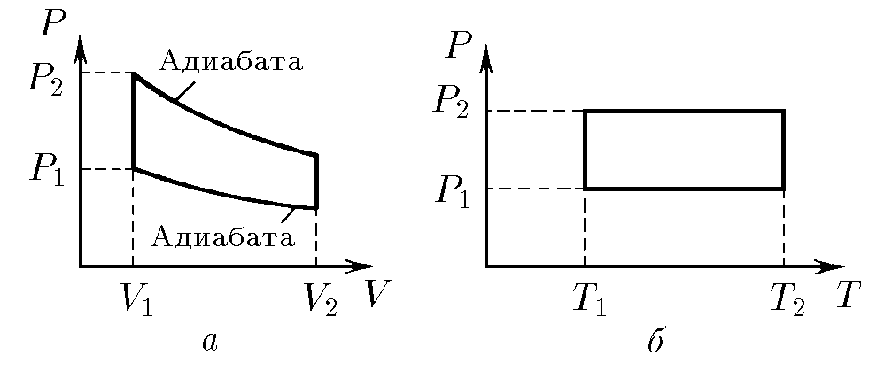
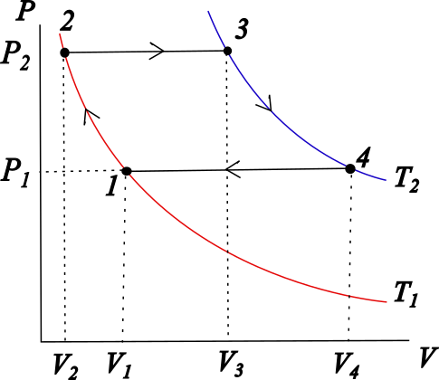

###  Statement 

$5.9.10^*$ Find the efficience of cycles shown in following figures, if as power agent it is taken a monoatomic ideal gas. 

### Solution

a) Let enumerate the states from 1 to 4 in clockwise sense starting in the coordinate $(P_1,V_1)$. The efficience is defined as $$\eta = 1-\frac{|Q_c|}{Q_h}=1-\frac{|Q_{34}|}{Q_{12}} \quad(1)$$ where $Q_{34}$ is the heat released by gas (cold reservoir) and $Q_{12}$ is the heat absorbed by gas (hot reservoir), while $Q_{23}$ and $Q_{41}$ are zero (adiabatic processes). Since $3-4$ is an isochoric process, $$Q_{34}=\Delta U_{34} = nC_v\left(T_4-T_3\right) \quad(2)$$ From Poisson Law $$P_1V_1^\gamma = P_4V_2^\gamma$$ and the state 4 is characterized by $$P_4V_2=nRT_4$$ So, separating $P_4$ and putting it into above Poisson law $$T_4 = \frac{P_1V_1^\gamma}{nRV_2^{\gamma -1}} \quad(3)$$ Proceeding similarly, $T_3$ can be found. Applying Poisson Law for process $2-3$, $$P_2V_1^\gamma =P_3V_2^\gamma$$ State equation for state 3 is $$P_3V_2=nRT_3$$ Separating $P_3$ and substituting into respective Poisson Law $$T_3 = \frac{P_2V_1^\gamma}{nRV_2^{\gamma -1}} \quad(4)$$ Substituting $(3)$ and $(4)$ into $(2)$, and as $C_v=iR/2$ $$Q_{34} = \frac{i}{2}\frac{V_1^\gamma}{V_2^{\gamma -1}}\left(P_1-P_2\right) \quad(5)$$ For the process $1-2$ $$Q_{12}=\Delta U_{12} = nC_v\left(T_2-T_1\right)$$ Taking account the state equations for states 1 and 2, temperatures can be found, $$Q_{12}=nC_v\left(\frac{P_2V_1}{nR}-\frac{P_1V_1}{nR}\right)$$ $$Q_{12}=\frac{i}{2}V_1\left(P_2-P_1\right) \quad(6)$$ Putting $(5)$ and $(6)$ into $(1)$ $$\eta = 1-\left(\frac{V_1}{V_2}\right)^{\gamma -1}$$ Since $\gamma =C_p/C_v=1+2/i$ and $i=3$ (monoatomic gas), $$\boxed{\eta = 1-\left(\frac{V_1}{V_2}\right)^{\frac{2}{3}}}$$ b) Let enumerate again the states following a clockwise way, this time starting in coordinate $(P_1,T_1)$. The efficience is $$\eta = 1-\frac{|Q_c|}{Q_h} \quad(I)$$ For identifying correctly the reservoirs, let's see the following graph corresponding to the cycle in a $P$ vs $V$ plot. 

  $P$ vs $V$ plot 

The hot reservoir is defined as $$Q_h = Q_{23} + Q_{34} \quad(II)$$ and cold one $$Q_c = Q_{12} + Q_{41} \quad(III)$$ Process $2-3$ is isobaric, then $$Q_{23}=nC_p\left(T_2-T_1\right) \quad(IV)$$ Process $3-4$ is isothermal, so $$Q_{34} = A_{34} = nRT_2\ln{\frac{V_4}{V_3}}$$ Since $V=nRT/P$ according state equation $$Q_{34} = nRT_2\ln{\frac{P_2}{P_1}} \quad(V)$$ Substituting $(IV)$ and $(V)$ into $(II)$and taking account that $C_p=(i+2)R/2$ $$Q_h = \frac{i+2}{2}nR\left(T_2-T_1\right)+nRT_2\ln{\frac{P_2}{P_1}} \quad(VI)$$ Process $1-2$ is isothermal, so $$Q_{12}=A_{12}=nRT_1\ln{\frac{V_2}{V_1}}$$ and newly, taking account state equation $$Q_{12}=A_{12}=nRT_1\ln{\frac{P_1}{P_2} \quad(VII)}$$ Finally, process $4-1$ is isobaric $$Q_{14} = nC_p\left(T_1-T_2\right) \quad(VIII)$$ Substituting $(VII)$ and $(VIII)$ into $(III)$ $$Q_c = nRT_1\ln{\frac{P_1}{P_2}}+\frac{i+2}{2}nR\left(T_1-T_2\right) \quad(IX)$$ Substituting $(VI)$ and $(IX)$ into $(I)$ and developing algebraically $$\eta = \frac{2\left(T_2-T_1\right)\ln{\frac{P_2}{P_1}}}{(i+2)\left(T_2-T_1\right)+2T_2\ln{\frac{P_2}{P_1}}}$$ Since gas is monoatomic, $i = 3$, hence $$\boxed{\eta = \frac{2\left(T_2-T_1\right)\ln{\frac{P_2}{P_1}}}{5\left(T_2-T_1\right)+2T_2\ln{\frac{P_2}{P_1}}}}$$ 
