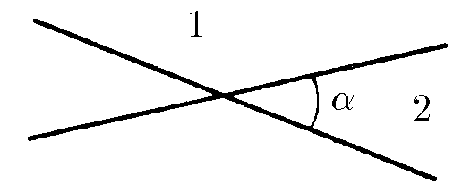
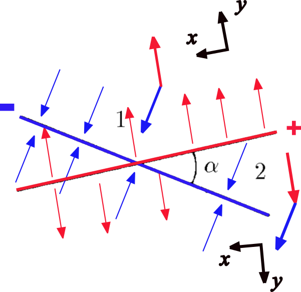

###  Statement

$6.2.10.$ Two infinite planes intersecting at an angle $\alpha$ divide space into four regions. What is the electric field strength in regions 1 and 2 if the surface charge density of the planes is $\pm \sigma$?

### Solution

Consider the following figure...

It's known that the electric field intensity for one of the faces of a infinite plane with surface charge density is $E = \frac{\sigma}{2\varepsilon_0}$.

For region 1 (see part $a$ of above figure):

$$
E_{R1y} = E - E \cos{\alpha} = \frac{\sigma}{2\varepsilon_0}(1-\cos{\alpha})
$$

and for $x$-direction,

$$
E_{R1x} = E \sin{\alpha} = \frac{\sigma}{2\varepsilon_0}\sin{\alpha}.
$$

So, as

$$
E_{R1} = \sqrt{E_{R1x}^2+E_{R1y}^2},
$$

and taking in account that

$$
\sin{\alpha} = \sqrt{\frac{1-\cos{\alpha}}{2}},
$$

it is obtained

#### Answer 1

$$
E_{R1} = \frac{\sigma}{\varepsilon_0}\sin{\frac{\alpha}{2}}
$$

For region 2, for $y$-direction:

$$
E_{R2y} = E(1+\cos{\alpha})=\frac{\sigma}{2\varepsilon_0}(1+\cos{\alpha})
$$

and for $x$-axis,

$$
E_{R2x} = E\sin{\alpha} = \frac{\sigma}{2\varepsilon_0}\sin{\alpha}.
$$

Again,

$$
E_{R2} = \sqrt{E_{R2x}^2+E_{R2y}^2}
$$

and taking in account that

$$
\cos{\frac{\alpha}{2}} = \sqrt{\frac{1+\cos{\alpha}}{2}}
$$

#### Answer 2

$$
E_{R2} = \frac{\sigma}{\varepsilon_0}\cos{\frac{\alpha}{2}}
$$