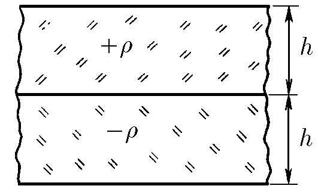

###  Statement

$6.2.11.$ Two infinite plates of thickness h are charged uniformly in volume and stacked together. The bulk charge density of the first plate is $\rho$, and the second plate -$\rho$. Find the maximum electric field intensity.

### Solution

The absolute value of the total charge of each plate is $\rho S h$, where $S$ is the surface of the plate's biggest faces. So, applying Gauss Law, the absolute value of electric field intensity generated by this plate is:

$$
E = \frac{\rho h}{\varepsilon_0}
$$

Then, the field generated by one of these biggest faces of the plate is half of $E$. Let's consider now a point inside of one of these infinite plates (for example, in the upper one). The resultant field over this point is the vectorial sum of the fields generated by a lower negative plate, a plate with thickness $x$ (where $x$ is the distance from the boundary between plates and the point), and a upper plate with thickness $h-x$:

$$
E_R(x) = \frac{\rho h}{2\varepsilon_0} + \frac{\rho (h-x)}{2\varepsilon_0} - \frac{\rho x}{2\varepsilon_0}
$$

$$
E_R(x) = \frac{\rho}{\varepsilon_0}(h-x)
$$

Hence, maximum field intensity is achieved when $x=0$, i.e., the point is in the boundary between plates.

#### Answer

$$
E_{max} = \frac{\rho h}{\varepsilon_0}
$$