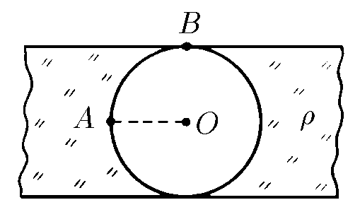

###  Statement

$6.2.12.$ In a uniformly charged infinite plate, a spherical cavity was cut out as shown in the figure. Plate's thickness is $h$ and its bulk charge density is $\rho$. What is the electric field strength at point $A$? At point $B$? Find the dependence of the electric field strength along the line $OA$ on the distance to the point $O$.

### Solution

The idea for solving this problem is to consider superposition principle: as cavity is uncharged, we can suppose that it exists a superposition of a plate (with charge density $\rho$) and a sphere with charge density $-\rho$. So, if we analyze the field in $A$ without cavity, we have two plates of thickness $\frac{h}{2}$, one over $A$ and the other one under A, both with charge density $\rho$, then field in $A$ is null. While for $A$ in the sphere's surface, applying Gauss's Law,

$$
-E_A\cdot 4\pi\left(\frac{h}{2}\right)^2 = -\frac{q_{enc}}{\varepsilon_0}
$$

as $V = \frac{4}{3}\pi\left(\frac{h}{2}\right)^3$, so $6\frac{V}{h} = 4\pi\left(\frac{h}{2}\right)^2$, and taking in account that $\rho = \frac{q_{enc}}{V}$

#### Answer 1

$$
E_A = \frac{\rho h}{6\varepsilon_0}
$$

For point $B$, the way is similar: in this case the plate without cavity generates certain field in $B$, located on its surface. From Gauss's Law

$$
E_p\cdot S = \frac{q_t}{\varepsilon_0}
$$

as $S = \frac{V}{h}$, and $\rho = \frac{q_t}{V}$

$$
E_p = \frac{\rho h}{\varepsilon_0}
$$

but, for one of the side of plate, field is $E_B' = \frac{E_p}{2} = \frac{\rho h}{2\varepsilon_0}$ Now, overlapping with field generated by sphere,

$$
E_B = E_B' - E_c
$$

where $E_c = E_A$,

#### Answer 2

$$
E_B = \frac{\rho h}{3\varepsilon_0}
$$

As $A$ is on line $OA$, all points over that line "feel" only the electric field generated by sphere. From Gauss's Law

$$
-E(r) \cdot 4\pi r^2 = -\frac{q_{enc}}{\varepsilon_0}
$$

as $V = \frac{4}{3}\pi r^3$, so $3\frac{V}{r} = 4\pi r^2$, and $\rho = \frac{q_{enc}}{V}$

#### Answer 3

$$
E(r) = \frac{\rho r}{3\varepsilon_0}
$$

for $0\leq r \leq \frac{h}{2}$.