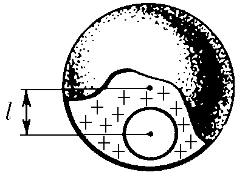
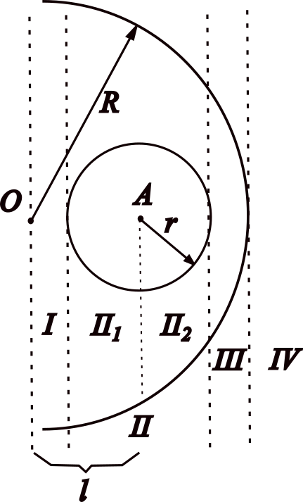

###  Statement 

$6.2.13.$ In a uniformly charged ball of radius $R$, a spherical cavity of radius $r$ was cut out, the center of which is located at a distance $l$ from the center of the ball. Bulk charge density is $\rho$. Find the electric field strength along a straight line passing through the center of the cavity and the center of the ball. Prove that the electric field in the cavity is homogeneous. 

### Solution

Here, the idea for solving the problem is to use superposition's principle: considering a sphere of radius $R$ (bigger one) with bulk charge density $\rho$ and smaller one with bulk charge density $-\rho$, such that when superposition occurs, the cavity have no charge. Moreover, let's consider the following figure for organizing the solving process. 

Above picture shows four regions to study. Let's begin with first one... Applying Gauss's Law for bigger sphere (without cavity) at distance $x$ from its center, $$E_b(x)\cdot 4\pi x^2 = \frac{q_{enc}}{\varepsilon_0} = \frac{\rho\cdot 4\pi x^3}{3\varepsilon_0}$$ $$E_b(x) = \frac{\rho x}{3\varepsilon_0} \quad (1)$$ while for smaller one, $$E_s(r')\cdot 4\pi r'^2 = \frac{q_{enc}'}{\varepsilon_0} = \frac{\rho\cdot 4\pi r^3}{3\varepsilon_0}$$ $$E_s(r') = \frac{\rho r^3}{3 r'^2 \varepsilon_0} \quad (2)$$ In this region $\vec{E_b}\uparrow\uparrow \vec{E_s}$, overlapping $$E(x,r') = E_s(r') + E_b(x) \quad (3)$$ 
Putting $(1)$ and $(2)$ into $(3)$, $$E(x,r') = \frac{\rho}{3\varepsilon_0}\left(x+\frac{r^3}{r'^2}\right)$$ but $r' = l-x$, so 

#### Answer 1

$$E_I(x) = \frac{\rho}{3\varepsilon_0}\left[x+\frac{r^3}{(l-x)^2}\right]$$ for $0\leq x\leq l-r$. 

For region II, let's separate region in two subregions II$_1$ and II$_2$. For first subregion, field generated by bigger sphere (without cavity) is given by $(1)$. While for smaller one, $$E_s(r')\cdot 4\pi r'^2 = \frac{q_{enc}'}{\varepsilon_0} = \frac{\rho\cdot 4\pi r'^3}{3\varepsilon_0}$$ 
$$E_s(r') = \frac{\rho r'}{3\varepsilon_0} \quad (4)$$ 
In this subregion, $\vec{E_s}\uparrow\uparrow \vec{E_b}$, so overlapping 
$$E_{II_1}(x,r') = E_s(r') + E_b(x) \quad (5)$$ Substituting (1) and (4) into (5), $$E_{II_1}(x,r') = \frac{\rho}{3\varepsilon_0}(x+r')$$ but $l=x+r'$, hence $$E_{II_1} = \frac{\rho l}{3\varepsilon_0}$$ For second subregion, field generated by bigger sphere (without cavity) still given by $(1)$ and the generated one by smaller sphere is given by $(4)$, but $\vec{E_s}\uparrow\downarrow\vec{E_b}$, so overlapping $$E_{II_2}(x,r') = E_b(x) - E_s(r') \quad (6)$$ Putting $(1)$ and $(4)$ into $(6)$ $$E_{II_2}(x,r') = \frac{\rho}{3\varepsilon_0}(x-r')$$ but in this case $l = x-r'$, $$E_{II_2} = \frac{\rho l}{3\varepsilon_0}$$ Finally, $E_{II_1} = E_{II_2} = E_{II}$ 

#### Answer 2

$$E_{II} = \frac{\rho l}{3\varepsilon_0}$$ for $l-r\leq x \leq l+r$ 

For region III, smaller-sphere's field is given by $(2)$, while bigger-sphere's field is given by $(1)$, as $\vec{E_s}\uparrow\downarrow\vec{E_b}$, overlapping $$E_{III}(r',x) = E_b(x) - E_s(r') \quad (7)$$ Putting $(1)$ and $(2)$ into $(7)$ $$E_{III}(x,r') = \frac{\rho}{3\varepsilon_0}\left(x - \frac{r^3}{r'^2}\right)$$ as $r' = x-l$, 

#### Answer 3

$$E_{III}(x) = \frac{\rho}{3\varepsilon_0}\left[x-\frac{r^3}{(x-l)^2}\right]$$ for $l+r \leq x \leq R$. 

For region IV (points outside bigger sphere), applying Gauss's Law for bigger sphere, $$E_b(x) \cdot 4\pi x^2 = \frac{q_{enc}}{\varepsilon_0} = \frac{\rho\cdot 4\pi R^3}{3\varepsilon_0}$$ $$E_b(x) = \frac{\rho R^3}{3\varepsilon_0 x^2} \quad (8)$$ while for smaller one, field is given by (4). Since $\vec{E_s}\uparrow\downarrow\vec{E_b}$, overlapping $$E_{IV}(x,r') = E_b(x) - E_s(r') \quad (9)$$ Putting $(4)$ and $(8)$ into $(9)$ $$E_{IV}(x,r') = \frac{\rho}{3\varepsilon_0}\left(\frac{R^3}{x^2}-\frac{r^3}{r'^2}\right)$$ but $l = x-r'$, 

#### Answer 4

$$E_{IV}(x) = \frac{\rho}{3\varepsilon_0}\left[\frac{R^3}{x^2}-\frac{r^3}{(x-l)^2}\right]$$ for $x > R$. 

For proofing the homogenity of field inside cavity, let's consider any point P inside cavity. Absolute value of bigger-sphere's field is given by $(1)$ and directed over $\hat{x}$ direction, while absolute value of smaller-sphere's field is given by $(4)$ and directed over $-\hat{r'}$ direction. Overlapping $$\vec{E}(x,r') = \vec{E_b}(x) + \vec{E_s}(r') = E_b(x) \hat{x} - E_s(r') \hat{r'} \quad (10)$$ Substituting $(1)$ and $(4)$ into $(10)$ $$\vec{E}(x,r') = \frac{\rho}{3\varepsilon_0}(x\hat{x}-r'\hat{r'})$$ $$\vec{E}(\vec{x},\vec{r'}) = \frac{\rho}{3\varepsilon_0}(\vec{x}-\vec{r'})$$ but $\vec{l} = \vec{x} -\vec{r'}$, hence $$\vec{E} = \frac{\rho\vec{l}}{3\varepsilon_0}$$ 

#### Answer 5

Since $E$ is constant, it is homogeneous inside cavity.
