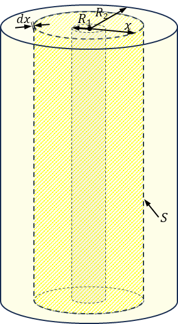

###  Statement 

$6.4.7^*.$ Find the capacity of a cylindrical capacitor formed by two coaxial cylinders of radius $R_1$ and $R_2$. Cylinder length $l \gg R_1$, $R_2$. 

### Solution

Let's subdivide the cylindrical capacitor into a series of capacitors with cross-sectional area $S$ and thickness $dx$ 

  Series of capacitors 

then the total capacitance $C_0$ of the capacitor could be found as $$\frac{1}{C_0} = \frac{1}{C_1} + \frac{1}{C_2} + \cdots +\frac{1}{C_{n-1}}+\frac{1}{C_n} = \sum_i\frac{1}{C_i}=\int\frac{1}{dC}\quad(1)$$ The capacitance of the small capacitor with the cross-sectional area $S$ and thickness $dx$ placed on the distance $x$ from the central axis of the cylinder $$dC = \frac{\varepsilon_0 S}{dx} = \varepsilon_0\frac{2\pi x l}{dx}\quad(2)$$ After substituting $(2)$ into $(1)$ $$\boxed{\frac{1}{C_0} = \frac{1}{2\pi\varepsilon_0l}\int_{R_1}^{R_2} \frac{dx}{x}}$$ After integration of the following expression $$\frac{1}{C_0} = \frac{1}{2\pi\varepsilon_0l}\cdot\ln{\frac{R_2}{R_1}} $$ After the transformations, we obtain the capacity of a cylindrical capacitor: $$\boxed{C_0 = \frac{2\pi\varepsilon_0l}{\ln{\frac{R_2}{R_1}}}} $$ 

#### Answer

$$C_0 = \frac{2\pi\varepsilon_0l}{\ln{\frac{R_2}{R_1}}}$$ 
