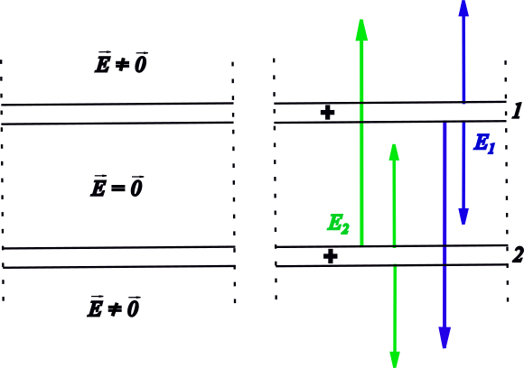
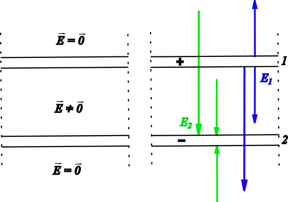

###  Statement 

$6.5.1$ a) The surface densities of charges in two planes are $\pm \sigma$. The distance between them is much less than the dimensions of them. What force per unit of surface of plane (electric pressure) will act? 

b) The intensity of electric field between two parallel planes is null, out of them is $E$. Find the surface density of charge in the planes. What electric pressure acts over the planes? 

c) The field intensity between two parallel planes is 10 000 V/cm, while out of them is null. Find the electric pressure over each plane and the surface density of charge. 

### Solution

a) The absolute value of the electric field created by each plate is $E = \frac{\sigma}{2\varepsilon_0}$, between them is $2E = \frac{\sigma}{\varepsilon_0}$ (superposition). The force that acts over a differential of charge $dq$ is $$d\vec{F} = \vec{E}dq = \pm\frac{\sigma}{2\varepsilon_0}dq~\hat{E}$$ As $dq = \pm\sigma~dS$, $$dF = \frac{\sigma^2~dS}{2\varepsilon_0}$$ and moving $dS$ to another member of equation, $$\boxed{P_e=\frac{dF}{dS}=\frac{\sigma^2}{2\varepsilon_0}}$$ b) Let's see following figure 

According to superposition principle between plates, $\vec{E_1}+\vec{E_2} = \vec{0}$, hence, $\vec{E_1}=-\vec{E_2}$ or $E_1 = E_2 = \frac{\sigma}{2\varepsilon_0}$. So, plates must have charges of same sign (+) or (-). The outside field is $$\vec{E} = \vec{E_1} + \vec{E_2}$$ $E = \frac{\sigma}{\varepsilon_0}$ $$\boxed{\sigma = \varepsilon_0 E} \quad(1)$$ The force that acts over an element of charge $dq$ in a plate is $dF_i = E_i~dq$ (i =1,2), but $E_i = \frac{E}{2}$ so, $$dF = \frac{E}{2}dq = \frac{E}{2}\sigma~dS$$ Hence, $$P_e = \frac{dF}{dS} = \frac{\sigma E}{2} \quad(2)$$ Putting $(1)$ into $(2)$ $$\boxed{P_e = \frac{\varepsilon_0~E^2}{2}}$$ c) See following figure 

  Electric field of plates 

Superposition of electric fields must be zero outside of capacitor, so $\vec{E_1} = -\vec{E_2}$, so plates must have opposed signs. Inside is valid that $\vec{E_1} = \vec{E_2}$ so, $$\vec{E} = 2\vec{E_1} = 2\vec{E_2}$$ $$E = \frac{\sigma}{\varepsilon_0}$$ with $\varepsilon_0$=8.85$\times$10$^{-12}$ F/m 

$$\boxed{\sigma = \varepsilon_0~E = 8.85\times10^{-6}~\rm{C/m^2}=8.85~\rm{\mu C/m^2}} \quad(4)$$ 

Since $P_e = \frac{\sigma^2}{2\varepsilon_0}$ and According $(4)$ $$\boxed{P_e = \frac{\varepsilon_0~E^2}{2}=4.425~\rm{Pa}}$$ 
