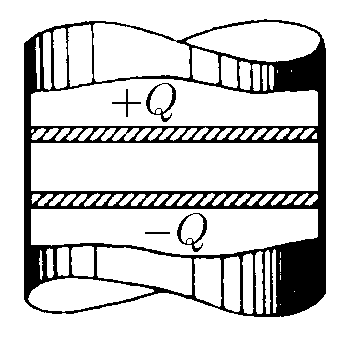
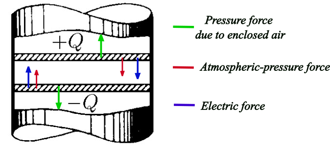

###  Statement

$6.5.2$ Two electroconductor pistons of cross section $S$ form a plane capacitor in a tube of an isolating material which contains air at atmospheric pressure $P_0$. How changes the distance between pistons if charges of different signs $\pm Q$ are applied to them? The system is good heat conductor and there is no friction.

### Solution

Let's consider the following figure

Applying Newton Second Law over one of the piston, considering the pistons are massless,

$$
F_p = F_{p0} + F_e
$$

where $F_p$, $F_{p0}$ and $F_e$ are forces due to enclosed air between pistons, due to atmospheric pressure and due to electric field, respectively.

$$
P = P_0 + \frac{F_e}{S} \tag{1}
$$

The electric force $F_e$ is defined from the electric field generated by a charged plate that is $E = \frac{\sigma}{2\varepsilon_0}=\frac{Q}{2\varepsilon_0 S}$, so

$$
F_e = Q E =\frac{Q^2}{2\varepsilon_0 S} \tag{2}
$$

Putting $(2)$ into $(1)$

$$
P = P_0 + \frac{Q^2}{2\varepsilon_0 S} \tag{3}
$$

Taking account that the system is good heat conductor, we can suppose that thermal equilibrium is instantaneously established or that the container acts as a thermos, keeping the temperature unchanged.Then, applying Boyle-Mariotte law

$$
P_0 S L = P S l
$$

$$
\frac{L}{l} = \frac{P}{P_0} \tag{4}
$$

Substituting $(3)$ into $(4)$

$$
\boxed{\frac{L}{l} = 1 + \frac{Q^2}{2P_0\varepsilon_0 S^2}}
$$