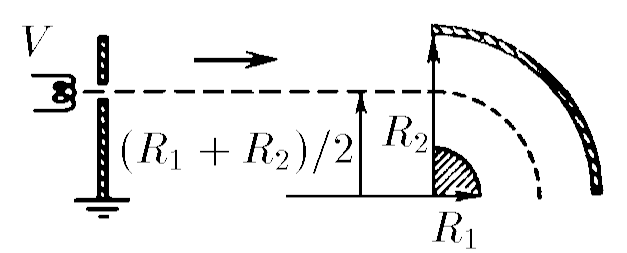

###  Statement

$7.1.12^*.$ Determine what the accelerating potential difference $V$ should be in order for the electrons to follow the path shown in the figure. Radii of cylindrical capacitor plates $R_1$ and $R_2$. Potential difference between the plates $V_0$.

  For problem $7.1.12^*$

### Solution

Gauss theorem

$$
\oint_{2\pi r}E\,dl=\frac{q}{\varepsilon_0}\Rightarrow E=\frac{q}{2\pi\varepsilon_0 r}
$$

Let's write down the small change of the electrostatic field and then integrate it

$$
dU=E \,dr\Rightarrow \int dU=\int E \,dr
$$

Integrate from $R_1$ to $R_2$

$$
U_0=\frac{q}{2\pi\varepsilon_0 r}\int_{R_1}^{R_2}\frac{dr}{r}=\frac{q}{2\pi\varepsilon_0 r}\ln\frac{R_2}{R_1}
$$

Law of conservation of energy

$$
\frac{mv^2}{2}=eU
$$

$$
e\frac{q}{2\pi\varepsilon_0 \frac{R_1+R_2}{2}}=\frac{mv^2}{(\frac{R_1+R_2}{2})}
$$

From where we get

$$
\frac{q}{2\pi\varepsilon_0}=\frac{mv^2}{e}
$$

Substituting the previously obtained values

$$
\frac{U_0}{\ln\frac{R_2}{R_1}}=\frac{2eU}{e}
$$

From where

$$
U=\frac{U_0}{2\ln\frac{R_2}{R_1}}
$$

#### Answer

$$
V=(V_0/2)/\ln(R_2/R_1)
$$