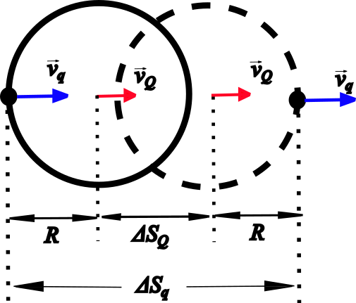

###  Statement

$7.1.17^*$ There are two diametrically opposed holes in a non-conductive thin-walled sphere with an uniformly distributed charge $Q$ which has mass $M$. At the initial istant, the sphere is in rest. Certain particle of mass $m$ and charge $q$ (same sign of $Q$) is moved from infinite with speed $v$ over line that join the holes. Determine the time which particle will be inside the sphere.

### Solution

Firstly, we consider the situation before $q$-particle penetrates $Q$-sphere. Since both bodies have equal-sign charges, $q$-particle will move with a deacceleration while $Q$-sphere will accelerate. Applying Energy Conservation Law (from the beginning until $q$-particle reaches $Q$-sphere surface)

$$
\frac{mv^2}{2} = \frac{mv_q^2}{2}+\frac{kQq}{R}+\frac{Mv_Q^2}{2} \quad(1)
$$

From Momentum Conservation Law

$$
mv = mv_q + Mv_Q \quad(2)
$$

Inside of $Q$-sphere, there is no electric field, then both bodies have constant velocities while $q$-particle be inside $Q$-sphere (see Figure). The displacement of $q$-particle is

$$
\Delta S_q = \Delta S_Q+2R = v_q~T \quad(3)
$$

And the sphere's displacement is

$$
\Delta S_Q = v_Q~T \quad(4)
$$

From $(4)$ in $(3)$, and separating $T$

$$
T = \frac{2R}{v_q-v_Q} \quad(5)
$$

Separating $v_q$ from $(2)$

$$
v_q = v - \frac{M}{m}v_Q \quad(6)
$$

Putting $(6)$ into $(1)$ and developing algebraically

$$
0 = \frac{M}{2}\left(1+\frac{M}{m}\right)v_Q^2-Mv~v_Q + \frac{kQq}{R} \quad(7)
$$

$(7)$ is a second-degree equation or quadratic equation in $v_Q$ ($AX^2+BX+C=0$). We can solve this by Discriminant method or General-Solution formula for quadratic equations. The Discriminant is

$$
D = B^2-4AC
$$

$$
D = M^2v^2-2M\left(1+\frac{M}{m}\right)\frac{kQq}{R}
$$

The solutions are

$$
X = \frac{-B\pm\sqrt{D}}{2A}
$$

$$
v_Q = \frac{Mv\pm\sqrt{M^2v^2-2M\left(1+\frac{M}{m}\right)\frac{kQq}{R}}}{M\left(1+\frac{M}{m}\right)} \quad(8)
$$

Substituting $(6)$ into $(5)$

$$
T = \frac{2R}{v-v_Q\left(1+\frac{M}{m}\right)} \quad(9)
$$

Putting $(8)$ into $(9)$

$$
T = \frac{2MR}{\mp\sqrt{M^2v^2-2M\left(1+\frac{M}{m}\right)\frac{kQq}{R}}}
$$

Choosing ``plus'' (+) sign, because time is non-negative, taking $k = 1/(4\pi\varepsilon_0)$ and developing

$$
\boxed{T = \frac{2R}{v}\left[1-\frac{qQ(M+m)}{2\pi\varepsilon_0mMv^2}\right]^{-\frac{1}{2}}}
$$

This is valid for $\frac{\mu v^2}{2}>\frac{qQ}{4\pi\varepsilon_0R}$, where $\mu = \frac{mM}{M+m}$ is the reduced mass.