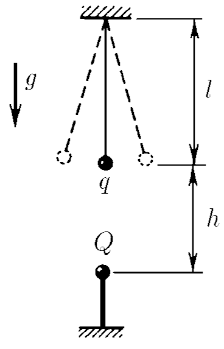
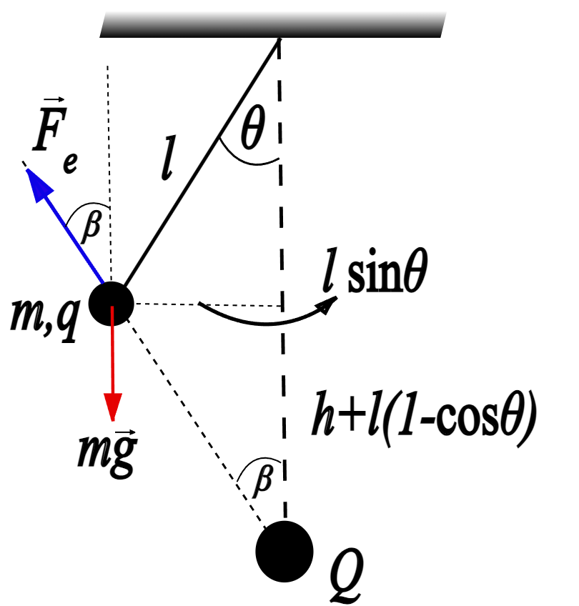

###  Statement 

$7.1.22^*.$ Find the frequency of small oscillations of the mathematical pendulum relative to its lower equilibrium position, if a charge $Q$ is fixed directly under the equilibrium position of the ball at a distance $h$ from it. Length of the thread $l$, mass of the ball $m$, charge $q$. 

### Solution

  Forces acting on pendulum. 

Applying Newton's Second Law: 

$$mg\sin{\theta}-\frac{kqQ}{\left[h+l(1-\cos\theta )\right]^2+l^2\sin^2 {\theta}}\sin{(\beta +\theta )} = m\frac{dv}{dt} \tag{1}$$ 

where, $$\tan{\beta} = \frac{l\sin{\theta}}{h+l\left(1-\cos\theta\right)} \tag{2}$$ and, it is known that $$\sin{(\beta +\theta )} = \sin{\beta}\cos{\theta}+\cos{\beta}\sin{\theta}$$ as $\theta$ is small (small oscillations), $\sin{\theta}\approx\theta$ and $\cos{\theta}\approx1-\theta^2/2$, then $$\sin{(\beta +\theta )} = \sin{\beta}\left(1-\frac{\theta^2}{2}\right)+\theta\cos{\beta} \label{E3} \tag{3}$$ Modifying $(2)$, $$\tan{\beta} = \frac{l\theta}{h+\frac{l\theta^2}{2}} \tag{4}$$ Substituting $(3)$ and $(4)$ into $(1)$ and taking account $\sin{\theta}\approx\theta$ 

$$mg\theta -\frac{kqQ}{\left(h+\frac{l\theta^2}{2}\right)^2+l^2\theta^2}\left[\sin{\beta}\left(1-\frac{\theta^2}{2}\right)+\theta\cos{\beta}\right] = m\frac{dv}{dt} \label{NSLmod}$$ 

Since angular acceleration is related to lineal acceleration according $dv/dt = \ddot{\theta}l$, dividing all equation by $ml$ and take out $\cos{\beta}$ from second term of left side, it is obtained 

$$\frac{g}{l}\theta -\frac{kqQ\cos{\beta}}{ml\left[\left(h+\frac{l\theta^2}{2}\right)^2+l^2\theta^2\right]}\left[\left(1-\frac{\theta^2}{2}\right)\tan{\beta}+\theta\right] = \ddot{\theta} \label{NEq} \tag{5}$$ 

Graphically it can be seen that, with cosine and sine approximations applied, $$\cos{\beta} = \frac{h+\frac{l\theta^2}{2}}{\sqrt{\left(h+\frac{l\theta^2}{2}\right)^2+l^2\theta^2}}$$ Putting $(4)$ and $(6)$ into $(5)$ and developing algebraically 

$$\frac{g}{l}\theta -\frac{kqQ}{ml}\frac{h}{\left[\left(h+\frac{l\theta^2}{2}\right)^2+l^2\theta^2\right]^{\frac{3}{2}}}\left[\left(1+\frac{l}{h+\frac{l\theta^2}{2}}\right)\theta -\frac{l\theta^3}{2h+l\theta^2}\right] = \ddot{\theta}$$ 

Since there are small oscillations, $\theta\rightarrow0$, but terms $\theta^2$ and $\theta^3$ tend to zero faster than $\theta$, so they are negligible respect to $\theta$. $$\left[\frac{g}{l}-\frac{kqQ\left(l+h\right)}{mh^3l}\right]\theta = \ddot{\theta}$$ as $k = \frac{1}{4\pi\varepsilon_0}$, $$\left[\frac{g}{l}-\frac{qQ\left(l+h\right)}{4\pi\varepsilon_0mh^3l}\right]\theta = \ddot{\theta}$$ Finally, $$\boxed{\omega = \sqrt{\frac{g}{l}-\frac{qQ\left(h+l\right)}{4\pi\varepsilon_0mh^3l}}}$$ valid for the condition $\frac{qQ(h+l)}{4\pi\varepsilon_0h^3} < mg$ 
