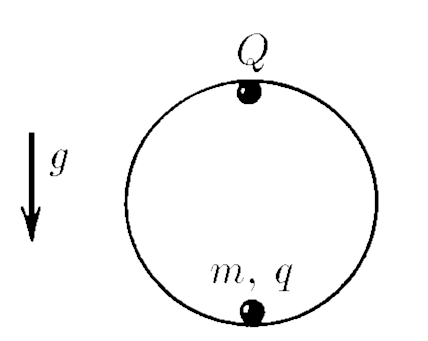
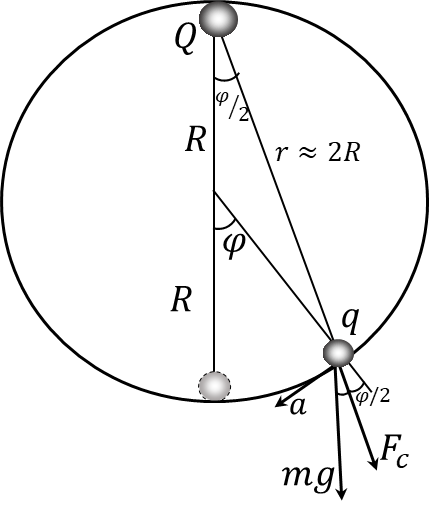

###  Statement

$7.1.23^*.$ Find the period of small vibrations of a body of mass $m$, whose charge is $q$, inside a smooth sphere of radius $R$, if the charge $Q$ is fixed at the top point of the sphere.

### Solution

  Forces acting on the system of two charges

Considering the fact that oscillations are small, $\varphi \ll 1$, we could use the approximations for small angle $\varphi$

$$
\sin\varphi \approx \varphi; \quad\cos\varphi \approx 1\tag{1}
$$

From where, we could approximate that the distance between charges remains approximately the same

$$
r\approx2R
$$

Thus, the сoulomb's law for two charges

$$
F_c = \frac{1}{4\pi\varepsilon_0}\frac{qQ}{4R^2}
$$

Let's write Newton's second law on a tangential trajectory, in the direction of motion of a charge of mass $m$

$$
ma = mg \sin\varphi + F_c \sin\frac{\varphi}{2}
$$

Considering the approximation $(1)$ and the expression

$$
ma = -mg\frac{x}{R} - \frac{x}{2R} \frac{1}{4\pi\varepsilon_0}\frac{qQ}{4R^2}
$$

$$
a = -x\left(\frac{g}{R}+\frac{qQ}{32\pi\varepsilon_0mR^3}\right)
$$

Solving the equation of harmonic oscillations $(\ddot{x}+\omega^2x(t)=0)$, we could obtain the value for angular velocity

$$
\omega =\sqrt{\frac{g}{R}+\frac{qQ}{32\pi\varepsilon_0mR^3}}
$$

From here the period of oscillation

$$
\boxed{T=\frac{2\pi}{\omega} = \frac{2\pi}{\sqrt{\frac{g}{R}+\frac{qQ}{32\pi\varepsilon_0mR^3}}}}
$$

Since the expression under the square root cannot be less than zero, the ratio at which there will be no oscillations

$$
\frac{g}{R}+\frac{qQ}{32\pi\varepsilon_0mR^3} > 0 \Leftrightarrow \boxed{\frac{qQ}{32\pi\varepsilon_0R^2}>-mg}
$$

#### Answer

$$
T=2\pi\left(\frac{g}{R}+\frac{qQ}{32\pi\varepsilon_0mR^3}\right)^{-1/2}\text{ with }\frac{qQ}{32\pi\varepsilon_0R^2}>-mg
$$