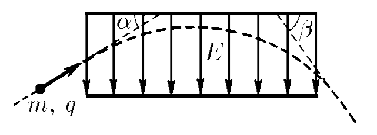

###  Statement 

$7.1.6$ Particles with mass $m$ and charge $q$ enter in a capacitor of length $l$ under an angle $\alpha$ respect to plate's plane and exit forming an angle $\beta$. Find the initial kinetic energy of particles, if the field intensity inside the capacitor is $E$. 

### Solution

Initial kinetic energy is defined as $$K_0 = \frac{mv_0^2}{2} \quad(1)$$ If we apply Newton's Second Law, acceleration can be defined, $$a_y = \frac{qE}{m} \quad(2)$$ As there are no forces in horizontal direction, the component of velocity in that direction is unaffected $$v_0\cos{\alpha}=v_1\cos{\beta} \quad(3)$$ For the horizontal path until exit's point $$l = v_0\cos{\alpha}~t_v \quad(4)$$ The time expended by particles during the path through the capacitor can be found from acceleration definition $$\vec{a_y} = \frac{\Delta \vec{v_y}}{\Delta t} = \frac{\vec{v_{1y}}-\vec{v_{0y}}}{t_v}$$ $$a_y = \frac{v_1\sin{\beta}+v_0\sin{\alpha}}{t_v}$$ $$t_v = \frac{v_1\sin{\beta}+v_0\sin{\alpha}}{a_y} \quad(5)$$ Substituting $v_1$ from $(3)$ into $(5)$ and developing algebraically $$t_v = v_0\cos{\alpha}\frac{\tan{\alpha}+\tan{\beta}}{a_y} \quad(6)$$ Putting $(6)$ into $(4)$ and separating $v_0$ $$v_0^2 = \frac{a_yl}{\cos^2 {\alpha}(\tan{\alpha}+\tan{\beta})}$$ and according to $(2)$, $$v_0^2 = \frac{qEl}{m\cos^2 {\alpha}(\tan{\alpha}+\tan{\beta})} \quad(7)$$ Finally, substituting $(7)$ into $(1)$ $$\boxed{K_0 = \frac{qEl}{2\cos^2 {\alpha}(\tan{\alpha}+\tan{\beta})}}$$ 
