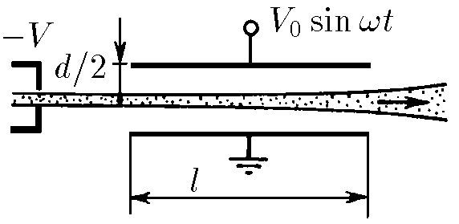

###  Statement

$7.3.9^*.$ A thin electron beam accelerated by the potential difference $V$ enters a flat capacitor parallel to its plates. Determine the angular spread of electrons if a voltage $V_0$ sin wt is applied to the capacitor plates. The distance between the plates of the capacitor $d$ is much smaller than its length $l$.

### Solution

From the drawing

$$
\tan\alpha = \frac{v_y}{v_x}
$$

Law of conservation of energy

$$
\frac{mv^2_x}{2}=eU
$$

From where

$$
v_x=\sqrt{\frac{2eU}{m}}
$$

Force $\vec{F}$ acting on the particle:

$$
F=eU=e\frac{U_0}{d}\sin\omega t
$$

Second Newton's Laws

$$
ma=\frac{eU_0}{d}\sin\omega t
$$

By the definition of acceleration $a = \frac{dv}{dt}$

$$
\frac{dv}{dt}=\frac{eU_0}{md}\sin\omega t
$$

Let's regroup and integrate

$$
\int _0^{v_y}dv=\frac{eU_0}{md}\int_0^t\sin\omega t\,dt
$$

$$
v_y=\frac{eU_0}{md\omega}(1-\cos\omega t)
$$

Time for which the particle will move horizontally by the value $l$

$$
t=\frac{l}{v_x}=l\sqrt{\frac{m}{2eU}}
$$

Find the angle of velocity to the horizontal

$$
\tan\theta = \frac{v_y}{v_x}=\frac{eU_0}{m\omega d}\sqrt{\frac{m}{2eU}} \left( 1-\cos\omega l \sqrt{\frac{m}{2eU}}\right)
$$

Whence the angle $\angle \theta$

$$
\boxed{\theta =\operatorname{\arctan } \left( \frac{U_0}{\omega d}\sqrt{\frac{e}{2mU}} \bigg[ 1-\cos\omega l \sqrt{\frac{m}{2eU}}\bigg] \right)}
$$

A little extra. Given that $d \ll l$ we can use the approximation $\tan x \approx x$

$$
{\theta = \frac{U_0}{\omega d}\sqrt{\frac{e}{2mU}} \bigg[ 1-\cos\omega l \sqrt{\frac{m}{2eU}}\bigg] }
$$

Find the required scattering angle

$$
{\Delta \alpha =2\theta = \frac{U_0}{\omega d}\sqrt{\frac{2e}{mU}} \bigg[ 1-\cos\omega l \sqrt{\frac{m}{2eU}}\bigg] }
$$

#### Answer

$$
\Delta\alpha =\pm\operatorname{\arctan }\bigg\\{\frac{V_{0}}{d\omega}\sqrt{\frac{2e}{m_{e}V}}\bigg[1-\operatorname{cos}\bigg(\omega l\sqrt{\frac{m_{e}}{2eV}}\bigg)\bigg]\bigg\\}
$$