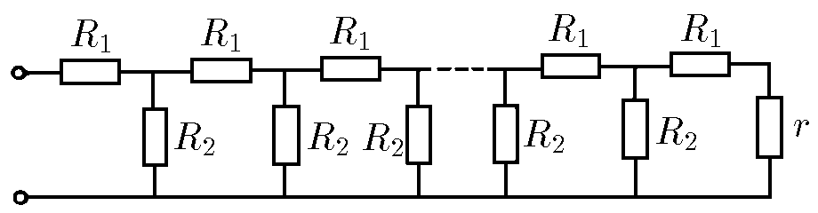
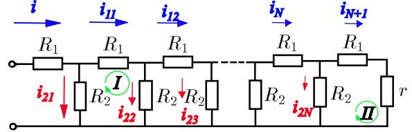

###  Statement

$8.3.15^*$ The attenuator is a voltage divider, the circuit of which is shown in the figure. What should be the resistances $R_1$ and $R_2$ so that at each subsequent resistance $R_1$ the voltage is ten times less than at the previous one?

### Solution

Let's consider the following figure

  Circuit analysis

Applying Kirchhoff Second Law (Loop's law). For loop $I$

$$
-i_{11}R_1-i_{22}R_2+i_{21}R_2=0
$$

$$
-i_{11}R_1+R_2(i_{21}-i_{22})=0 \quad(1)
$$

As $i_{11}R_1 = 10 i_{12}R_1$, that is, $i_{1n} = 10 i_{1(n+1)}$, hence

$$
i_{1n} = \frac{i_{11}}{10^{n-1}} \;\forall~n\geq2 \quad(2)
$$

For loop $II$ and according $(2)$

$$
-i_{N+1}(R_1+r)+i_{2N}R_2=0
$$

$$
-\frac{i_{11}}{10^{N-1}}(R_1+r)+i_{2N}R_2=0 \quad(3)
$$

For subsequent bifurcations (applying Kirchhoff First Law)

$$
i_{11} = i_{12}+i_{22}
$$

$$
i_{22} = i_{11}-i_{12}
$$

So,

$$
i_{2n} = i_{1(n-1)}-i_{1n} \;\forall~n\geq2 \quad(4)
$$

According $(2)$, let's modify $(4)$

$$
i_{2n} = \frac{i_{11}}{10^{n-2}}-\frac{i_{11}}{10^{n-1}}
$$

$$
i_{2n} = \frac{9i_{11}}{10^{n-1}} \quad(5)
$$

According $(5)$ into $(3)$

$$
9R_2 = R_1+r \quad(6)
$$

According $(5)$, from $(1)$

$$
R_1 = \frac{81}{10} R_2 \quad(7)
$$

Finally, solving the equation system formed by $(6)$ and $(7)$, it is obtained

$$
\boxed{R_1 = 9r}
$$

and,

$$
\boxed{R_2 = \frac{10}{9}r}
$$