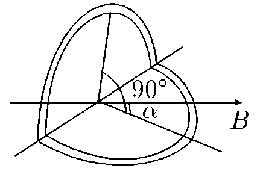

###  Statement 

$9.1.12.$ A coil of radius $R$ was bent along its diameter at a right angle and placed in a uniform magnetic field of induction B so that one of the planes of the coil was located at an angle $\alpha$, the other at an angle $\frac{\pi}{2}-\alpha$ to the direction of induction $B$. The current in the coil is $I$. Determine the moment of forces acting on the coil. 

### Solution

Let's split the circuit into two circuits with the same current, but in different planes.

Let's find the moment of forces for each of them: $$ M_1 = \frac{1}{2}\pi R^2IB\cdot \sin\alpha $$ $$ M_2 = \frac{1}{2}\pi R^2IB\cdot \sin\left(\frac{\pi}{2} -\alpha\right) = \frac{1}{2}\pi R^2IB\cdot \cos\alpha $$ Total moment of forces $$ \boxed{M = M_1 + M_2 = \frac{1}{2}\pi R^2IB\cdot (\sin\alpha + \cos\alpha )} $$ 

#### Answer

$$M = \frac{1}{2}\pi R^2IB\cdot (\sin\alpha + \cos\alpha )$$ 
