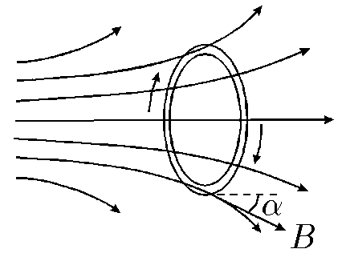

###  Statement 

$9.1.14.$ A ring of radius $R$, through which a current $I$ circulates, is placed in a non-uniform axially symmetric field. The axis of the ring coincides with the axis of symmetry of the magnetic field. The induction of the magnetic field $B$ acting on the current is directed at an angle $\alpha$ to the axis of symmetry of the field. The mass of the ring is $m$. Determine the acceleration of the ring. 

### Solution

The ring will be accelerated by the tangential component of magnetic induction $B_{\|}$ since its perpendicular component $B_\bot$ is directed at the deformation of the ring. 

At each point of the ring this is $B\sin\alpha$ since the acceleration does not change direction when turning $dl$ then: $$ ma = 2\pi RIB\sin\alpha\Rightarrow \boxed{a = 2\pi\frac{RIB\sin\alpha}{m}} $$ 

#### Answer

$$a = 2\pi\frac{RIB\sin\alpha}{m} $$ 
