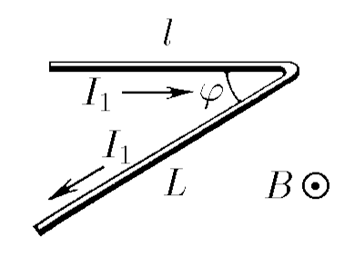

###  Statement

$9.1.3.$ A linear conductor of length $l$, located perpendicular to a magnetic field, is acted upon by a force $F$ if the current in the conductor is $I$. With what force will the magnetic field act on:

a) a conductor of length $l + L$ bent at an angle $\varphi$, if the plane of the bend is perpendicular to the magnetic field, and the current in the conductor is $I_1$
b) a conductor in the form of a semicircle of radius $R$, through which a current $I_2$ flows, if the plane of the semicircle is perpendicular to the magnetic field?

### Solution

a) From Ampere's law, we find the magnetic field induction $B$

$$
F_1 = Il \cdot B \Rightarrow B = \frac{F}{Il}\tag{1}
$$

in this case, the numbers acting on the part of the wire with currents $I_1$ and $I_2$, respectively

$$
F_1 = I_1l \cdot B; \quad F_2 = I_1L\cdot B
$$

We substitute $(1)$:

$$
F_1= \frac{I_1}{I}F; \quad F_2 = \frac{I_1L}{Il}F
$$

The force acting on a piece of wire bent at an angle $\varphi$ can be found from the cosine law

$$
|\vec{F_p}| = |\vec{F_1} + \vec{F_2}| = \sqrt{{F_1}^2+{F_2}^2+2 F_1 F_2\cdot\cos\varphi}
$$

$$
\boxed{|\vec{F_p}| = F\frac{I_1}{I}\sqrt{1+\frac{L^2}{l^2} + 2\frac{L}{l}\cdot\cos\varphi}}
$$

b) For a conductor made of a semicircle, we will use the same formula for the magnetic field induction $B$

$$
B = \frac{F}{Il}
$$

On a small part of a conductor of length $dl$, the Ampere force acts

$$
dF = B I_2~dl = B I_2R~d\theta
$$

To find the force $F$, we integrate the forces acting on each part of the semiring.

$$
F = \int\limits_{-\frac{\pi}{2}}^{\frac{\pi}{2}} \cos\theta dF = BI_2R\int\limits_{-\frac{\pi}{2}}^{\frac{\pi}{2}} \cos\theta~d\theta
$$

After mathematical transformations, we obtain the force acting on the semiring

$$
\boxed{F = 2BI_2R = 2F\frac{I_2R}{Il}}
$$

#### Answer

$$
F\frac{I_1}{I}\sqrt{1+\frac{L^2}{l^2} + 2\cos\varphi\frac{L}{l}};\quad2F\frac{I_2R}{Il}
$$