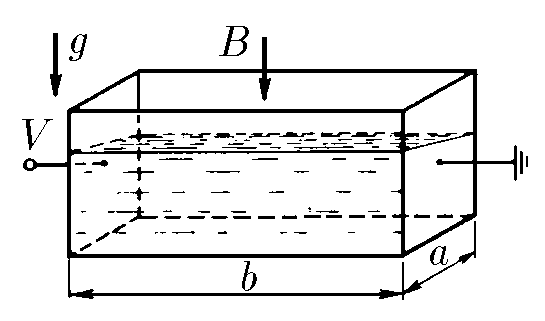

###  Statement

$9.1.4.$ An electrolyte with density $\rho$ and specific conductivity $\lambda$ is poured into a rectangular cuvette, two opposite walls of which are metallic and the rest are made of an insulator. Voltage $V$ is applied to the metallic walls of the cuvette, and the entire cuvette is placed in a uniform vertical magnetic field of induction $B$. Determine the difference in liquid levels near the non-metallic walls of the cuvette. The length of the cuvette is $a$, the width is $b$.

### Solution

We will find the resistance between the connected contacts as

$$
R = \frac{\rho l}{S} = \frac{l}{\lambda S}
$$

At voltage $V$, according to Ohm's law, we find the current $I$ as

$$
I = \frac{V}{R} = \frac{V\lambda S}{l} = \frac{V\lambda}{b}S\tag{1}
$$

The angle of inclination of the liquid level $\alpha$, we express from the equilibrium condition, and through the change in the electrolyte level $\Delta h$

$$
\tan\alpha = \frac{\Delta h}{a}=\frac{F}{mg}\tag{2}
$$

From Ampere's law

$$
F = Ib \cdot B
$$

Substituting the value of current $I$ from expression $(1)$

$$
F= V\lambda SB= V\lambda a \left(h + \frac{\Delta h}{2}\right)
$$

Considering that the mass of the electrolyte $m = \rho hS$, we rewrite the expression $(2)$

$$
\tan\alpha =\frac{V\lambda SB}{\rho hsg} \Rightarrow \boxed{\Delta h = \frac{V\lambda Ba}{h\rho g}}
$$

#### Answer

$$
\Delta h = \frac{V\lambda Ba}{h\rho g}
$$