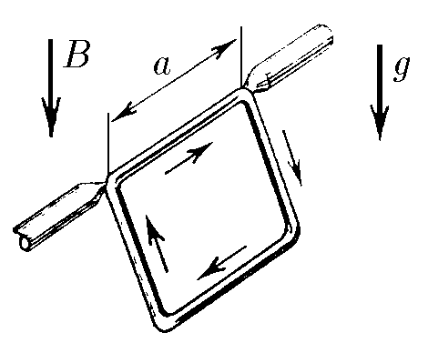

###  Statement 

$9.1.6.$ A square frame with current is fixed so that it can rotate freely around its horizontal side. The frame is in a vertical uniform magnetic field of induction $B$. The angle of the frame to the horizon is $\alpha$, its mass is $m$, and the length of the side is $a$. Find the current in the frame. 

### Solution

The moment of forces acting on the frame from the magnetic field caused by the Ampere force $$ M_B = Fa = Ba^2I\sin\alpha $$ Moment of gravity: $$ M_{mg} = mg\cdot \frac{a}{2}\cos\alpha $$ In the equilibrium condition, the sum of the moments of external forces, taking into account the direction, is equal to zero $(M_B = M_{mg})$: $$ B \sin\alpha~\cdot aI = \frac{1}{2}mg\cdot \cos\alpha $$ Where do we find the current in the frame? $$ \boxed{I = \frac{mg\cdot \cot\alpha}{2Ba}} $$ 

#### Answer

$$I = \frac{mg\cdot \cot\alpha}{2Ba} $$ 
