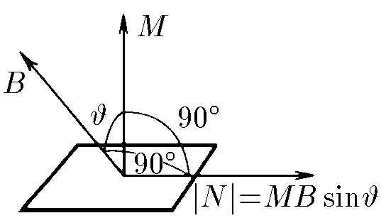

###  Statement 

$9.1.7.$ A rectangular frame with current is placed in a uniform magnetic field. The magnetic induction B is parallel to the plane of the frame. The area of the frame is $S$, the current in it is $I$. 

a) Prove that the moment of forces acting on the frame is $N = BM$, where $M = IS$ is the magnetic moment of the frame. 

b) Prove that the moment of forces acting on the frame in the case when the magnetic induction is directed as shown in the figure is equal to $\vec{N} =[\vec{M} \times \vec{B} ]$ where $M$ is the magnetic moment of the frame, the modulus of which is equal to $IS$, and the direction is perpendicular to the plane of the frame. 

### Proof

a) The moment of force will be created by the lines of the frame perpendicular to the lines of magnetic induction $B$. Let the frame have dimensions $a$ by $b$ (for definiteness, we will consider $b \bot B$), then the moment of the Ampere force will be: $$ N = 2\cdot |\vec{Ib} \times \vec{B}|\cdot \frac{a}{2} = Ib \cdot B \cdot a $$ given the area of the frame $(S = ab)$, then the moment of forces acting on the frame $$ \boxed{\boxed{N = IBS = BM}} $$ 

b) the perpendicular component of magnetic induction $B_{\bot}$ will be directed towards stretching the frame and will not create a moment of force $(N=0)$, while the moment created by $B_{\|}$ is $$ N = B_{\|}IS = BIS\sin\alpha =|\vec{IS} \times \vec{B}| $$ since $\vec{N} = \vec{F} \times \vec{r}$, then it will be true that $\vec{N} = \vec{IS} \times \vec{B}$, because the direction of the moment is perpendicular to the force and the arm of the force $$ \boxed{\boxed{\vec{N} = \vec{M} \times \vec{B}}} $$ 
